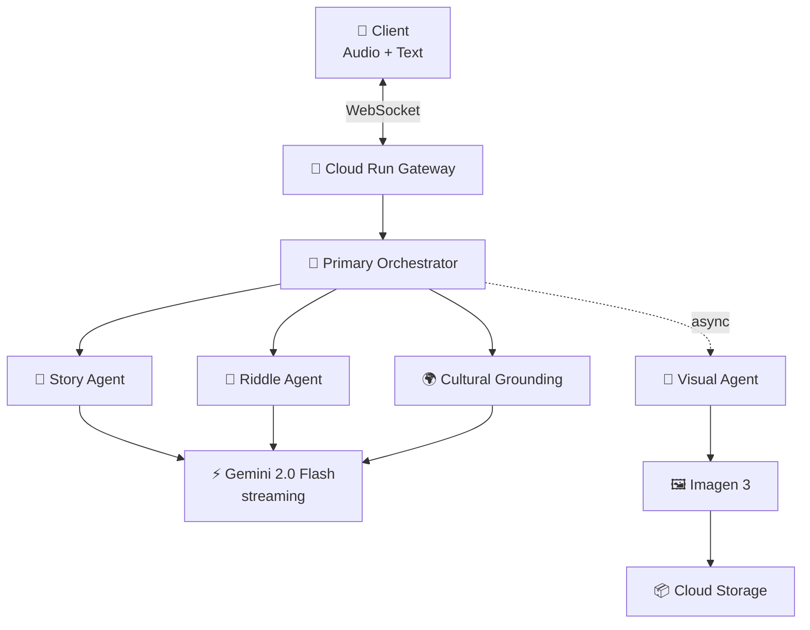

# 🌍 HadithiAI Live

### The First African Immersive Oral AI Agent

> A real-time, multimodal, multi-agent oral storytelling system rooted in African cultural traditions. Powered by Google Gemini Live API with bidirectional audio/text streaming.

---

## 📁 Project Structure

```
hadithiAI_orchestrator/
│
├── 📄 README.md                          ← You are here
├── 📄 requirements.txt                   ← Python dependencies
├── 📄 Dockerfile                         ← Container image definition
├── 📄 .env.example                       ← Environment variables template
├── 📄 .gitignore                         ← Git ignore rules
│
├── 📂 docs/
│   └── 📄 ARCHITECTURE.md               ← Full architecture document
│
├── 📂 src/                               ← Application source code
│   ├── 📄 main.py                        ← FastAPI entry point
│   │
│   ├── 📂 core/                          ← Core configuration & models
│   │   ├── 📄 __init__.py
│   │   ├── 📄 config.py                  ← Pydantic settings (env vars)
│   │   ├── 📄 models.py                  ← All Pydantic data models
│   │   └── 📄 logging_config.py          ← Structured logging setup
│   │
│   ├── 📂 gateway/                       ← WebSocket gateway layer
│   │   ├── 📄 __init__.py
│   │   ├── 📄 websocket_handler.py       ← WebSocket endpoint & connection mgmt
│   │   └── 📄 health.py                  ← Health check endpoints
│   │
│   ├── 📂 orchestrator/                  ← Central orchestration layer
│   │   ├── 📄 __init__.py
│   │   ├── 📄 primary_orchestrator.py    ← Main orchestrator (brain)
│   │   ├── 📄 agent_dispatcher.py        ← Routes requests to sub-agents
│   │   ├── 📄 streaming_controller.py    ← Output stream management
│   │   └── 📄 circuit_breaker.py         ← Fault tolerance pattern
│   │
│   ├── 📂 agents/                        ← Specialized sub-agents
│   │   ├── 📄 __init__.py
│   │   ├── 📄 base_agent.py             ← Abstract base agent class
│   │   ├── 📄 story_agent.py            ← African story generation
│   │   ├── 📄 riddle_agent.py           ← Interactive riddle games
│   │   ├── 📄 cultural_agent.py         ← Cultural grounding & validation
│   │   └── 📄 visual_agent.py           ← Imagen 3 image generation
│   │
│   └── 📂 services/                      ← External service clients
│       ├── 📄 __init__.py
│       ├── 📄 gemini_client.py           ← Gemini Live API + text generation
│       ├── 📄 firestore_client.py        ← Firestore operations
│       └── 📄 memory_manager.py          ← Session & conversation memory
│
├── 📂 static/                            ← Web client
│   └── 📄 index.html                    ← Single-page web client
│
├── 📂 infrastructure/                    ← Infrastructure-as-Code
│   └── 📄 main.tf                       ← Terraform configuration
│
├── 📂 scripts/                           ← Deployment scripts
│   ├── 📄 deploy.sh                     ← Linux/Mac deployment
│   └── 📄 deploy.ps1                    ← Windows PowerShell deployment
│
└── 📂 tests/                             ← Test suite
    └── 📄 test_orchestrator.py           ← Orchestrator unit tests
```

---

## 🚀 Quick Start

### Prerequisites

- Python 3.12+
- Google Cloud project with billing enabled
- `gcloud` CLI installed and authenticated
- Enabled APIs: Cloud Run, Firestore, Storage, Vertex AI

### Local Development

```bash
# 1. Clone and enter the project
cd hadithiAI_orchestrator

# 2. Create virtual environment
python -m venv .venv
.venv\Scripts\activate        # Windows
# source .venv/bin/activate   # Linux/Mac

# 3. Install dependencies
pip install -r requirements.txt

# 4. Configure environment
copy .env.example .env
# Edit .env with your Google Cloud project details

# 5. Authenticate with Google Cloud
gcloud auth application-default login

# 6. Run locally
cd src
python main.py
```

Open http://localhost:8080 in your browser.

### Deploy to Google Cloud

```powershell
# Windows
$env:GOOGLE_CLOUD_PROJECT = "your-project-id"
.\scripts\deploy.ps1
```

```bash
# Linux/Mac
export GOOGLE_CLOUD_PROJECT="your-project-id"
./scripts/deploy.sh
```

### Deploy with Terraform

```bash
cd infrastructure
terraform init
terraform plan -var="project_id=your-project-id"
terraform apply -var="project_id=your-project-id"
```

---

## 🏗️ Architecture Summary



**Key Design Decisions:**
- **Single Cloud Run service** — all agents run in-process for minimal latency
- **Gemini Live API function calling** — intent detection triggers sub-agents
- **Cultural Grounding in hot path** — every response is validated
- **Async image generation** — never blocks the conversation
- **Circuit breakers** — graceful degradation when sub-agents fail

See [docs/ARCHITECTURE.md](docs/ARCHITECTURE.md) for the complete architecture document.

---

## 🎯 Hackathon Evaluation Targets

| Criteria | Weight | Our Approach |
|----------|--------|-------------|
| **Innovation** | 40% | First African oral AI agent; cultural grounding as architecture |
| **Architecture** | 30% | Multi-agent hierarchy; streaming-first; fault-tolerant |
| **Demo** | 30% | Live voice conversation; interruption; cultural switching |

---

## 📊 Performance Targets

| Metric | Target |
|--------|--------|
| Time to first audio byte | < 800ms |
| End-to-end perceived latency | < 500ms (streaming) |
| Cultural validation latency | < 50ms (hot path) |
| Image generation | 5-15s (async, non-blocking) |
| Concurrent sessions per instance | 80 |

---

## 🛡️ Key Features

- ✅ **Real-time bidirectional streaming** (Gemini Live API)
- ✅ **User interruption handling** (speak over the AI)
- ✅ **Multi-agent orchestration** (Story, Riddle, Cultural, Visual)
- ✅ **Cultural grounding validation** (hot path, every response)
- ✅ **Hallucination mitigation** (6-layer defense)
- ✅ **Fault tolerance** (circuit breakers, graceful degradation)
- ✅ **Session memory** (Firestore, no authentication required)
- ✅ **Image generation** (Imagen 3, async)
- ✅ **Observability** (structured logging, Cloud Trace)
- ✅ **One-command deployment** (Cloud Run)

---

## 📝 License

Built for the Google Gemini API Developer Competition.

Made with ❤️ for Africa's oral traditions.
