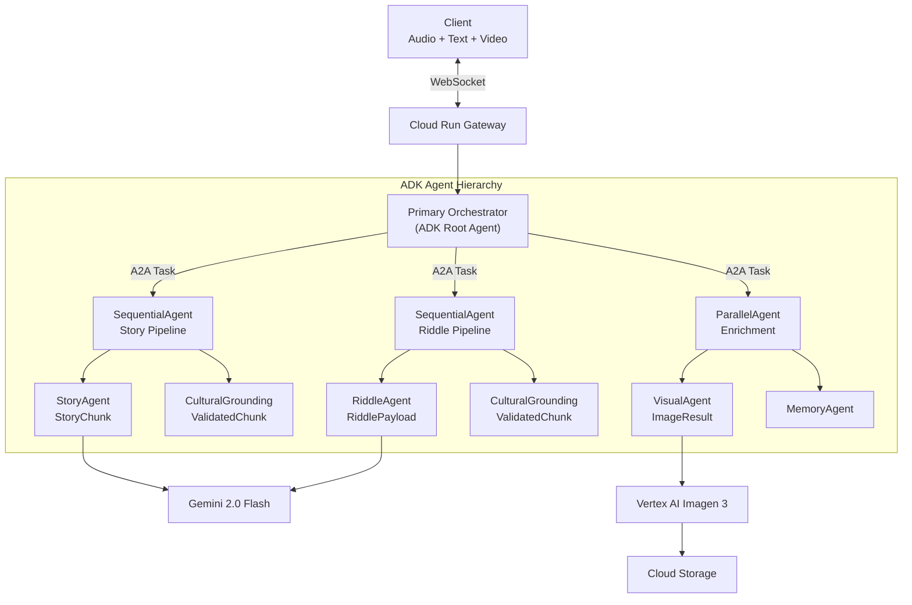

# HadithiAI Live

### The First African Immersive Oral AI Agent

> A real-time, multimodal, multi-agent oral storytelling system rooted in African cultural traditions. Built with Google ADK (Agent Development Kit), A2A protocol, and Gemini Live API for bidirectional audio/text/vision streaming.

---

## Project Structure

```
hadithiAI_orchestrator/
|
+-- README.md                             <- You are here
+-- requirements.txt                      <- Python dependencies
+-- Dockerfile                            <- Container image definition
+-- .env.example                          <- Environment variables template
+-- .gitignore                            <- Git ignore rules
|
+-- docs/
|   +-- ARCHITECTURE.md                   <- Full architecture document (v3.0)
|
+-- src/                                  <- Application source code
|   +-- main.py                           <- FastAPI entry point
|   |
|   +-- core/                             <- Core configuration, models & schemas
|   |   +-- __init__.py
|   |   +-- config.py                     <- Pydantic settings (env vars)
|   |   +-- models.py                     <- Pydantic data models + A2ATask
|   |   +-- schemas.py                    <- JSON schema contracts (A2A)
|   |   +-- logging_config.py            <- Structured logging setup
|   |
|   +-- gateway/                          <- WebSocket gateway layer
|   |   +-- __init__.py
|   |   +-- websocket_handler.py          <- WebSocket endpoint (audio/text/video)
|   |   +-- health.py                     <- Health check endpoints
|   |
|   +-- orchestrator/                     <- Central orchestration layer
|   |   +-- __init__.py
|   |   +-- primary_orchestrator.py       <- Main orchestrator (ADK root agent)
|   |   +-- agent_dispatcher.py           <- Routes requests to sub-agents
|   |   +-- a2a_router.py                <- A2A task routing + schema enforcement
|   |   +-- streaming_controller.py       <- Output stream management
|   |   +-- circuit_breaker.py            <- Fault tolerance pattern
|   |
|   +-- agents/                           <- ADK-compatible sub-agents
|   |   +-- __init__.py
|   |   +-- base_agent.py                <- Abstract base (execute/execute_streaming)
|   |   +-- story_agent.py               <- Story generation (StoryChunk output)
|   |   +-- riddle_agent.py              <- Riddle generation (RiddlePayload output)
|   |   +-- cultural_agent.py            <- Cultural grounding (ValidatedChunk output)
|   |   +-- visual_agent.py              <- Image generation (ImageResult output)
|   |   +-- memory_agent.py              <- Session memory (ADK ParallelAgent)
|   |
|   +-- services/                         <- External service clients
|       +-- __init__.py
|       +-- gemini_client.py              <- Gemini Live API + text generation
|       +-- firestore_client.py           <- Firestore operations
|       +-- storage_client.py             <- Cloud Storage operations
|       +-- memory_manager.py             <- Session & conversation memory
|
+-- static/                               <- Web client
|   +-- index.html                        <- Single-page web client
|
+-- infrastructure/                       <- Infrastructure-as-Code
|   +-- main.tf                           <- Terraform configuration
|
+-- scripts/                              <- Deployment scripts
|   +-- deploy.sh                         <- Linux/Mac deployment
|   +-- deploy.ps1                        <- Windows PowerShell deployment
|
+-- tests/                                <- Test suite
    +-- test_orchestrator.py              <- Orchestrator unit tests
    +-- test_schemas.py                   <- Schema contract tests
```

---

## Quick Start

### Prerequisites

- Python 3.12+
- Google Cloud project with billing enabled
- `gcloud` CLI installed and authenticated
- Enabled APIs: Cloud Run, Firestore, Storage, Vertex AI

### Local Development

```bash
# 1. Clone and enter the project
cd hadithiAI_orchestrator

# 2. Create virtual environment
python -m venv .venv
.venv\Scripts\activate        # Windows
# source .venv/bin/activate   # Linux/Mac

# 3. Install dependencies
pip install -r requirements.txt

# 4. Configure environment
copy .env.example .env
# Edit .env with your Google Cloud project details

# 5. Authenticate with Google Cloud
gcloud auth application-default login

# 6. Run locally
cd src
python main.py
```

Open http://localhost:8080 in your browser.

### Deploy to Google Cloud

```powershell
# Windows
$env:GOOGLE_CLOUD_PROJECT = "your-project-id"
.\scripts\deploy.ps1
```

```bash
# Linux/Mac
export GOOGLE_CLOUD_PROJECT="your-project-id"
./scripts/deploy.sh
```

### Deploy with Terraform

```bash
cd infrastructure
terraform init
terraform plan -var="project_id=your-project-id"
terraform apply -var="project_id=your-project-id"
```

---

## Architecture Overview

HadithiAI uses a **Google ADK multi-agent hierarchy** with **A2A (Agent-to-Agent) protocol** for typed inter-agent communication. Every agent boundary is guarded by **JSON schema validation** (Draft-07).



### A2A Schema Contracts

Every agent declares input/output schemas. The A2A router validates data at every boundary:

| Agent | Input Schema | Output Schema |
|-------|-------------|---------------|
| StoryAgent | StoryRequest | StoryChunk |
| RiddleAgent | RiddleRequest | RiddlePayload |
| CulturalGrounding | StoryChunk | ValidatedChunk |
| VisualAgent | ImageRequest | ImageResult |
| MemoryAgent | (internal) | (internal) |

### Key Design Decisions

- **Single Cloud Run service** -- all agents run in-process for minimal latency
- **Gemini Live API function calling** -- intent detection triggers sub-agents
- **ADK agent hierarchy** -- SequentialAgent and ParallelAgent composition patterns
- **A2A typed tasks** -- JSON schema enforcement on every agent boundary
- **Cultural Grounding in hot path** -- every story/riddle response is validated
- **Async image generation** -- never blocks the conversation stream
- **Video frame support** -- Gemini Live receives camera frames for vision tasks
- **Circuit breakers** -- graceful degradation when sub-agents fail

See [docs/ARCHITECTURE.md](docs/ARCHITECTURE.md) for the complete architecture document.

---

## Hackathon Evaluation Targets

| Criteria | Weight | Our Approach |
|----------|--------|-------------|
| **Innovation** | 40% | First African oral AI agent; cultural grounding as architecture |
| **Architecture** | 30% | ADK multi-agent hierarchy; A2A schema contracts; streaming-first |
| **Demo** | 30% | Live voice conversation; interruption; cultural switching; vision |

---

## Performance Targets

| Metric | Target |
|--------|--------|
| Time to first audio byte | < 800ms |
| End-to-end perceived latency | < 500ms (streaming) |
| Cultural validation latency | < 50ms (hot path) |
| Schema validation overhead | < 1ms per boundary |
| Image generation | 5-15s (async, non-blocking) |
| Concurrent sessions per instance | 80 |

---

## Key Features

- Real-time bidirectional streaming (Gemini Live API)
- Video/vision input support (camera frames to Gemini)
- User interruption handling (speak over the AI)
- ADK multi-agent orchestration (Story, Riddle, Cultural, Visual, Memory)
- A2A protocol with JSON schema contracts at every agent boundary
- Cultural grounding validation (hot path, every response)
- Hallucination mitigation (6-layer defense)
- Fault tolerance (circuit breakers, graceful degradation)
- Session memory (Firestore, no authentication required)
- Async image generation (Imagen 3, non-blocking)
- Observability (structured logging, Cloud Trace)
- One-command deployment (Cloud Run)

---

## License

Built for the Google Gemini API Developer Competition.

Made with care for Africa's oral traditions.
