# HadithiAI Live -- Architecture Document

## The First African Immersive Oral AI Agent

### Production-Grade System Architecture v3.0

---

## Table of Contents

1. [Executive Summary](#1-executive-summary)
2. [System Architecture Overview](#2-system-architecture-overview)
3. [Architecture Diagrams](#3-architecture-diagrams)
4. [Google ADK Multi-Agent Design](#4-google-adk-multi-agent-design)
5. [Agent-to-Agent (A2A) Protocol](#5-agent-to-agent-a2a-protocol)
6. [JSON Schema Contracts](#6-json-schema-contracts)
7. [Streaming Execution Flow](#7-streaming-execution-flow)
8. [Video and Vision Integration](#8-video-and-vision-integration)
9. [Cultural Grounding Layer](#9-cultural-grounding-layer)
10. [Hallucination Mitigation Strategy](#10-hallucination-mitigation-strategy)
11. [Cloud Run Deployment Architecture](#11-cloud-run-deployment-architecture)
12. [Latency Optimization Strategy](#12-latency-optimization-strategy)
13. [Observability and Monitoring](#13-observability-and-monitoring)
14. [Scaling Strategy](#14-scaling-strategy)
15. [Fault Tolerance](#15-fault-tolerance)
16. [Risk Analysis and Mitigation](#16-risk-analysis-and-mitigation)
17. [Folder Structure and Best Practices](#17-folder-structure-and-best-practices)
18. [Infrastructure-as-Code](#18-infrastructure-as-code)
19. [Hackathon Judges Optimization](#19-hackathon-judges-optimization)

---

## 1. Executive Summary

**HadithiAI Live** is a real-time, multimodal, multi-agent oral storytelling
system rooted in African cultural traditions. It is built on **Google Agent
Development Kit (ADK)** with native **Agent-to-Agent (A2A) protocol** support,
uses Gemini 2.0 Flash Live API for bidirectional audio/text/vision streaming,
and delivers immersive cultural experiences with sub-second perceived latency.

### Why This is Not a Prompt Router

Most hackathon entries use a single LLM with a system prompt that branches
on keywords. HadithiAI Live is fundamentally different:

| Prompt Router (Typical) | HadithiAI Live (This Project) |
|---|---|
| Single model, single prompt | Hierarchical agent tree via Google ADK |
| Intent parsed from text | Function calling via Gemini Live API |
| No inter-agent communication | A2A protocol with typed JSON contracts |
| Monolithic response | Parallel pipelines with streaming merge |
| No grounding | Cultural grounding agent in the hot path |
| Batch response | Token-level partial streaming |
| No vision | Multimodal input (audio + text + video frames) |
| No schema enforcement | Strict JSON schema on every agent boundary |

### Key Differentiators

- **Google ADK native**: True agent hierarchy with `Agent`, `SequentialAgent`,
  `ParallelAgent`, and `LoopAgent` primitives
- **A2A protocol**: Agents communicate through typed `Task` objects with strict
  JSON schema contracts, enabling composability and auditing
- **Streaming-first**: Bidirectional WebSocket with Gemini Live API, partial
  output at the token level, backpressure control
- **Cultural grounding in the hot path**: Every chunk is validated before
  reaching the user, not post-hoc
- **Multimodal**: Audio input/output, text, generated images, and optional
  video frame understanding
- **Interruption-native**: Users can interrupt mid-story, mirroring the
  participatory nature of African oral tradition

### Technology Stack

| Layer | Technology | Rationale |
|---|---|---|
| Agent Framework | Google ADK (Python) | Native Gemini integration, agent hierarchy, tool use |
| A2A Protocol | google-a2a | Typed inter-agent communication, schema enforcement |
| AI Engine | Gemini 2.0 Flash Live API | Bidirectional streaming, function calling, native TTS |
| Sub-Agent LLM | Gemini 2.0 Flash (text) | Fast text generation for specialized agents |
| Image Generation | Imagen 3 via Vertex AI | High-quality culturally appropriate imagery |
| Gateway | FastAPI + uvicorn | Async WebSocket, production-grade ASGI |
| Database | Firestore Native | Sub-ms reads, serverless, real-time listeners |
| Storage | Cloud Storage | Generated images, audio assets |
| Compute | Cloud Run (Gen2) | WebSocket support, warm containers, autoscaling |
| Observability | Cloud Logging + Cloud Trace + Cloud Monitoring | Structured logs, distributed tracing, dashboards |
| IaC | Terraform | Reproducible, version-controlled infrastructure |

---

## 2. System Architecture Overview

### Architectural Pattern: ADK Hierarchical Agent Orchestration

The system implements a **true multi-agent hierarchy** using Google ADK
primitives. This is not a dispatch table -- it is a tree of agents where
each node has its own model configuration, tools, and state.

```
Root Agent (Orchestrator)
  |-- SequentialAgent: Story Pipeline
  |     |-- StoryAgent (generates narrative)
  |     +-- CulturalGroundingAgent (validates each chunk)
  |
  |-- SequentialAgent: Riddle Pipeline
  |     |-- RiddleAgent (generates riddle structure)
  |     +-- CulturalGroundingAgent (validates cultural claims)
  |
  |-- ParallelAgent: Enrichment Pipeline
  |     |-- VisualAgent (generates scene image via Imagen 3)
  |     +-- MemoryAgent (persists turn, updates context)
  |
  +-- CulturalGroundingAgent (standalone, for direct cultural queries)
```

### Core Design Principles

1. **ADK-Native**: Every agent is a `google.adk.agents.Agent` subclass with
   declared tools, sub-agents, and model configuration
2. **A2A Contracts**: Every agent boundary uses typed JSON schemas for input
   and output; malformed responses are rejected and retried
3. **Stream-First**: Every component is designed for streaming, never batch
4. **Async-Native**: All I/O is non-blocking via Python asyncio
5. **Fail-Graceful**: Sub-agent failure degrades experience, never crashes
   the conversation
6. **Culture-Anchored**: Cultural grounding is mandatory in the processing
   pipeline, not an optional post-filter

---

## 3. Architecture Diagrams

### 3.1 High-Level Cloud Architecture

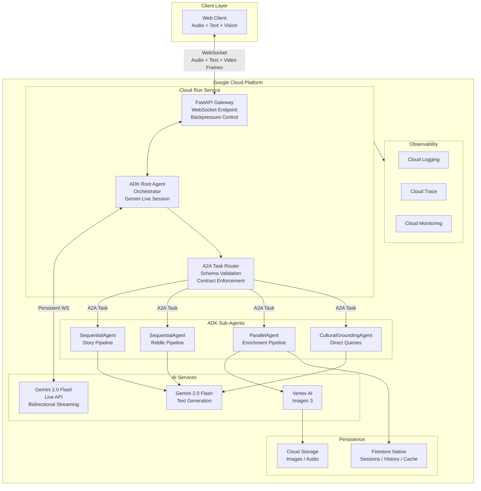

### 3.2 ADK Agent Hierarchy

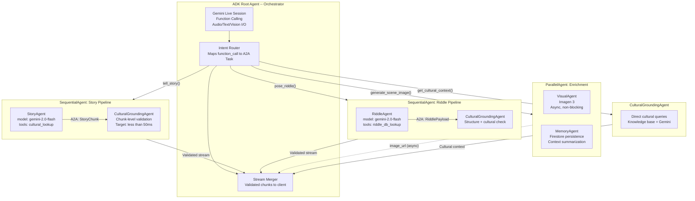

### 3.3 Real-Time Streaming Flow

```mermaid
graph LR
  subgraph INPUT["Input Pipeline"]
    Mic["Microphone\nPCM 16kHz"]
    Cam["Camera\nVideo frames (optional)"]
    WS1["WebSocket\naudio_chunk / video_frame"]
    GW1["Gateway\nInput Queue"]
  end

  subgraph PROCESSING["Processing Pipeline"]
    Gemini["Gemini Live API\nVAD + Transcription\n+ Intent Detection"]
    FC["Function Call Event\ntell_story / pose_riddle"]
    A2ADispatch["A2A Task Dispatch\nSchema-validated input"]
    Agent["Sub-Agent Pipeline\nStreaming Generation"]
    Validate["Cultural Grounding\nChunk Validation\nJSON Contract Check"]
  end

  subgraph OUTPUT["Output Pipeline"]
    Buffer["Stream Controller\nSentence Boundary Buffer\nBackpressure"]
    WS2["WebSocket\ntext + audio + image"]
    Speaker["Speaker / Display\nMultimodal Output"]
  end

  Mic -->|"100ms chunks"| WS1
  Cam -.->|"1 fps"| WS1
  WS1 --> GW1
  GW1 --> Gemini
  Gemini -->|"function_call"| FC
  FC --> A2ADispatch
  A2ADispatch --> Agent
  Agent -->|"StoryChunk"| Validate
  Validate -->|"ValidatedChunk"| Buffer
  Buffer -->|"Sentence-aligned"| WS2
  WS2 --> Speaker
```

### 3.4 Sequence Diagram -- Live Interaction

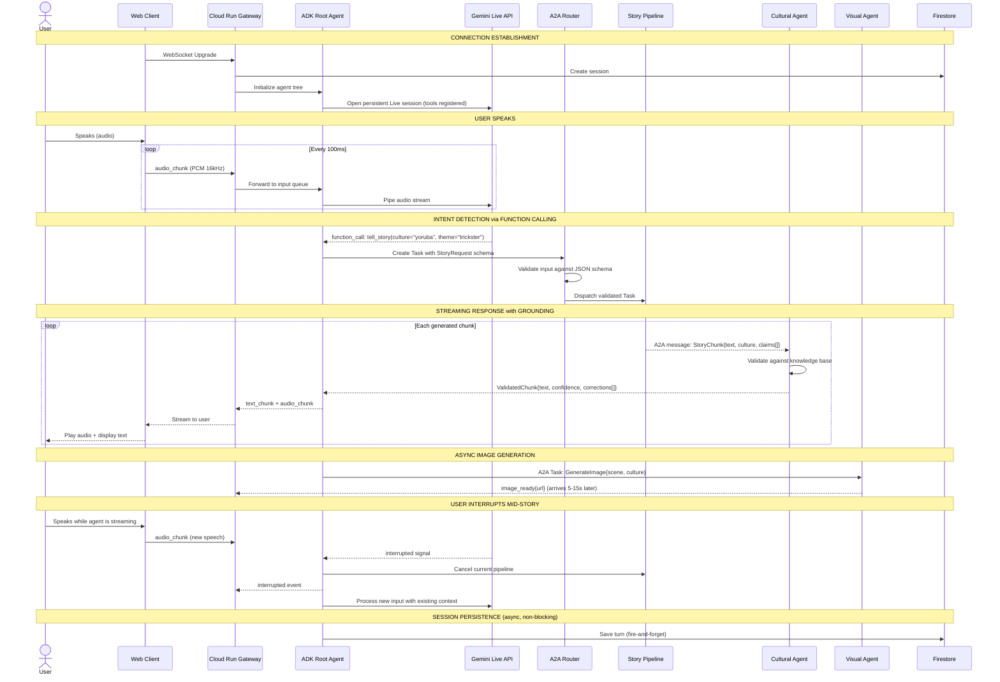

---

## 4. Google ADK Multi-Agent Design

### 4.1 Why Google ADK

Google Agent Development Kit (ADK) provides first-class primitives for building
multi-agent systems on Gemini:

| ADK Feature | How We Use It |
|---|---|
| `Agent` | Each sub-agent (Story, Riddle, Cultural, Visual) is an `Agent` with its own model config and tools |
| `SequentialAgent` | Story Pipeline: generate then validate. Riddle Pipeline: generate then validate. |
| `ParallelAgent` | Enrichment Pipeline: image generation + memory persistence run concurrently |
| `LoopAgent` | Riddle interaction: multi-turn hint/guess loop until resolved |
| Tool declarations | Each agent declares typed tools that Gemini can call |
| Session management | ADK manages conversation state across the agent tree |
| Callbacks | `before_agent_callback` and `after_agent_callback` for tracing and validation |

### 4.2 Agent Definitions (Pseudo-code)

```python
from google.adk.agents import Agent, SequentialAgent, ParallelAgent, LoopAgent
from google.adk.tools import FunctionTool
from google.adk.sessions import InMemorySessionService

# -- Root Orchestrator Agent --
root_agent = Agent(
    name="hadithiai_orchestrator",
    model="gemini-2.0-flash-live",
    instruction=ORCHESTRATOR_SYSTEM_PROMPT,
    tools=[
        FunctionTool(tell_story),
        FunctionTool(pose_riddle),
        FunctionTool(generate_scene_image),
        FunctionTool(get_cultural_context),
    ],
    sub_agents=[story_pipeline, riddle_pipeline, enrichment_pipeline, cultural_agent],
    before_agent_callback=trace_agent_start,
    after_agent_callback=trace_agent_end,
)

# -- Story Pipeline (Sequential: generate then validate) --
story_agent = Agent(
    name="story_agent",
    model="gemini-2.0-flash",
    instruction=STORY_SYSTEM_PROMPT,
    tools=[FunctionTool(cultural_lookup)],
    output_schema=StoryChunkSchema,
)

cultural_grounding_agent = Agent(
    name="cultural_grounding",
    model="gemini-2.0-flash",
    instruction=CULTURAL_VALIDATION_PROMPT,
    output_schema=ValidatedChunkSchema,
)

story_pipeline = SequentialAgent(
    name="story_pipeline",
    sub_agents=[story_agent, cultural_grounding_agent],
)

# -- Riddle Pipeline (Sequential then Loop for interaction) --
riddle_agent = Agent(
    name="riddle_agent",
    model="gemini-2.0-flash",
    instruction=RIDDLE_SYSTEM_PROMPT,
    output_schema=RiddlePayloadSchema,
)

riddle_pipeline = SequentialAgent(
    name="riddle_pipeline",
    sub_agents=[riddle_agent, cultural_grounding_agent],
)

# -- Enrichment Pipeline (Parallel: image + memory) --
visual_agent = Agent(
    name="visual_agent",
    model="gemini-2.0-flash",
    instruction="Generate an Imagen 3 prompt for the given scene.",
    tools=[FunctionTool(call_imagen3)],
    output_schema=ImageRequestSchema,
)

memory_agent = Agent(
    name="memory_agent",
    model="gemini-2.0-flash",
    instruction="Summarize and persist the current conversation turn.",
    tools=[FunctionTool(save_to_firestore), FunctionTool(summarize_history)],
)

enrichment_pipeline = ParallelAgent(
    name="enrichment_pipeline",
    sub_agents=[visual_agent, memory_agent],
)
```

### 4.3 ADK Session Management

```python
from google.adk.sessions import InMemorySessionService, Session

session_service = InMemorySessionService()

# Create a session per WebSocket connection
session = session_service.create_session(
    app_name="hadithiai",
    user_id=session_id,
)

# Session state is shared across the agent tree
session.state["culture_pref"] = "yoruba"
session.state["conversation_summary"] = ""
session.state["active_story"] = None
```

### 4.4 ADK Callback Hooks for Observability

```python
import time
from google.cloud import trace_v2

async def trace_agent_start(callback_context):
    """Called before each agent executes."""
    callback_context.state["_trace_start"] = time.time()
    callback_context.state["_agent_name"] = callback_context.agent_name
    logger.info(f"Agent started: {callback_context.agent_name}")

async def trace_agent_end(callback_context):
    """Called after each agent completes."""
    elapsed = (time.time() - callback_context.state.get("_trace_start", 0)) * 1000
    agent = callback_context.state.get("_agent_name", "unknown")
    logger.info(
        f"Agent completed: {agent} in {elapsed:.0f}ms",
        extra={"agent": agent, "latency_ms": elapsed, "event": "agent_complete"},
    )
```

---

## 5. Agent-to-Agent (A2A) Protocol

### 5.1 Why A2A

The A2A protocol provides a standard way for agents to communicate through
typed `Task` objects. Instead of passing raw strings between agents, every
message has a declared schema that is validated at the boundary.

Benefits:
- **Type safety**: Malformed agent outputs are caught before they propagate
- **Auditability**: Every inter-agent message is structured and loggable
- **Composability**: Agents can be swapped without changing the pipeline
- **Error isolation**: Schema violations produce clear error messages

### 5.2 A2A Task Flow

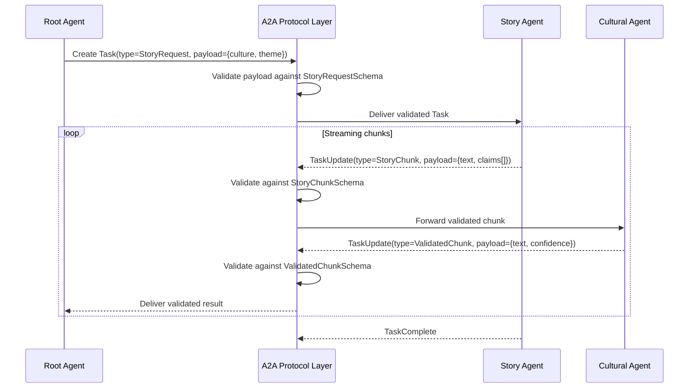

### 5.3 A2A Agent Card

Each agent publishes an **Agent Card** describing its capabilities:

```json
{
  "name": "story_agent",
  "description": "Generates culturally-rooted African oral tradition stories",
  "version": "1.0.0",
  "capabilities": {
    "input_schemas": ["StoryRequest"],
    "output_schemas": ["StoryChunk"],
    "streaming": true,
    "max_latency_ms": 500
  },
  "skills": [
    {
      "id": "generate_story",
      "name": "Generate African Story",
      "input_schema": "StoryRequest",
      "output_schema": "StoryChunk"
    }
  ]
}
```

---

## 6. JSON Schema Contracts

### 6.1 Design Principles

Every agent boundary enforces a strict JSON schema contract. This means:

1. The orchestrator validates input before dispatching to a sub-agent
2. The sub-agent's output is validated before being forwarded
3. Schema violations trigger a retry with corrective instructions
4. After 2 failed retries, the agent returns a safe fallback

### 6.2 Schema Definitions

**StoryRequest** (Orchestrator to Story Agent):
```json
{
  "$schema": "http://json-schema.org/draft-07/schema#",
  "title": "StoryRequest",
  "type": "object",
  "required": ["culture", "theme"],
  "properties": {
    "culture": {
      "type": "string",
      "description": "African ethnic group or tradition",
      "examples": ["yoruba", "zulu", "kikuyu", "ashanti", "maasai"]
    },
    "theme": {
      "type": "string",
      "description": "Story theme",
      "enum": ["trickster", "creation", "wisdom", "courage", "love", "origin", "moral"]
    },
    "complexity": {
      "type": "string",
      "enum": ["child", "teen", "adult"],
      "default": "adult"
    },
    "continuation": {
      "type": "boolean",
      "default": false,
      "description": "Whether to continue a previous story"
    },
    "session_context": {
      "type": "string",
      "description": "Summary of conversation history"
    }
  },
  "additionalProperties": false
}
```

**StoryChunk** (Story Agent output, per chunk):
```json
{
  "$schema": "http://json-schema.org/draft-07/schema#",
  "title": "StoryChunk",
  "type": "object",
  "required": ["text", "culture"],
  "properties": {
    "text": {
      "type": "string",
      "minLength": 1,
      "description": "The story text for this chunk"
    },
    "culture": {
      "type": "string",
      "description": "The culture this chunk references"
    },
    "cultural_claims": {
      "type": "array",
      "items": {
        "type": "object",
        "properties": {
          "claim": { "type": "string" },
          "category": {
            "type": "string",
            "enum": ["proverb", "custom", "character", "location", "language", "historical"]
          }
        }
      },
      "description": "Explicit cultural claims made in this chunk that need validation"
    },
    "scene_description": {
      "type": "string",
      "description": "If present, triggers async image generation"
    },
    "is_final": { "type": "boolean", "default": false }
  },
  "additionalProperties": false
}
```

**ValidatedChunk** (Cultural Agent output, per chunk):
```json
{
  "$schema": "http://json-schema.org/draft-07/schema#",
  "title": "ValidatedChunk",
  "type": "object",
  "required": ["text", "confidence"],
  "properties": {
    "text": {
      "type": "string",
      "description": "The validated (possibly corrected) text"
    },
    "confidence": {
      "type": "number",
      "minimum": 0.0,
      "maximum": 1.0,
      "description": "Cultural accuracy confidence score"
    },
    "corrections": {
      "type": "array",
      "items": { "type": "string" },
      "description": "List of corrections applied"
    },
    "rejected_claims": {
      "type": "array",
      "items": { "type": "string" },
      "description": "Claims that were removed due to low confidence"
    },
    "is_final": { "type": "boolean", "default": false }
  },
  "additionalProperties": false
}
```

**RiddlePayload** (Riddle Agent output):
```json
{
  "$schema": "http://json-schema.org/draft-07/schema#",
  "title": "RiddlePayload",
  "type": "object",
  "required": ["opening", "riddle_text", "answer", "culture"],
  "properties": {
    "opening": {
      "type": "string",
      "description": "Traditional riddle opening in the culture's language"
    },
    "riddle_text": {
      "type": "string",
      "description": "The riddle itself"
    },
    "answer": {
      "type": "string",
      "description": "The answer to the riddle"
    },
    "hints": {
      "type": "array",
      "items": { "type": "string" },
      "minItems": 3,
      "maxItems": 3,
      "description": "Progressive hints (easy, medium, obvious)"
    },
    "explanation": {
      "type": "string",
      "description": "Cultural context and significance"
    },
    "culture": {
      "type": "string",
      "description": "Cultural origin"
    },
    "is_traditional": {
      "type": "boolean",
      "description": "True if this is a known traditional riddle"
    }
  },
  "additionalProperties": false
}
```

**ImageRequest** (Visual Agent input):
```json
{
  "$schema": "http://json-schema.org/draft-07/schema#",
  "title": "ImageRequest",
  "type": "object",
  "required": ["scene_description", "culture"],
  "properties": {
    "scene_description": {
      "type": "string",
      "minLength": 10,
      "description": "Detailed description of the scene to illustrate"
    },
    "culture": {
      "type": "string",
      "description": "Cultural context for art style and visual elements"
    },
    "aspect_ratio": {
      "type": "string",
      "enum": ["16:9", "1:1", "9:16"],
      "default": "16:9"
    }
  },
  "additionalProperties": false
}
```

### 6.3 Schema Validation in the Pipeline

```python
import jsonschema

class A2ASchemaValidator:
    """Validates A2A messages against registered JSON schemas."""

    def __init__(self):
        self._schemas: dict[str, dict] = {}

    def register(self, name: str, schema: dict):
        jsonschema.Draft7Validator.check_schema(schema)
        self._schemas[name] = schema

    def validate(self, schema_name: str, data: dict) -> tuple[bool, list[str]]:
        """
        Validate data against a named schema.
        Returns (is_valid, list_of_errors).
        """
        schema = self._schemas.get(schema_name)
        if not schema:
            return False, [f"Unknown schema: {schema_name}"]

        validator = jsonschema.Draft7Validator(schema)
        errors = [e.message for e in validator.iter_errors(data)]
        return len(errors) == 0, errors

    def validate_or_reject(self, schema_name: str, data: dict) -> dict:
        """Validate and raise on failure."""
        is_valid, errors = self.validate(schema_name, data)
        if not is_valid:
            raise SchemaViolationError(schema_name, errors)
        return data

class SchemaViolationError(Exception):
    def __init__(self, schema_name: str, errors: list[str]):
        self.schema_name = schema_name
        self.errors = errors
        super().__init__(f"Schema '{schema_name}' violation: {'; '.join(errors)}")
```

### 6.4 Retry on Schema Violation

```python
async def dispatch_with_schema_enforcement(
    agent: Agent,
    input_data: dict,
    input_schema: str,
    output_schema: str,
    max_retries: int = 2,
) -> dict:
    """Dispatch to agent with schema enforcement and retry."""
    # Validate input
    validator.validate_or_reject(input_schema, input_data)

    for attempt in range(max_retries + 1):
        result = await agent.execute(input_data)

        is_valid, errors = validator.validate(output_schema, result)
        if is_valid:
            return result

        if attempt < max_retries:
            logger.warning(
                f"Schema violation from {agent.name}, retrying "
                f"(attempt {attempt + 1}/{max_retries}): {errors}"
            )
            # Add corrective instruction for retry
            input_data["_correction"] = (
                f"Your previous output had schema errors: {errors}. "
                f"Fix them and respond again."
            )
        else:
            logger.error(f"Agent {agent.name} failed schema after {max_retries} retries")
            return generate_safe_fallback(output_schema)
```

---

## 7. Streaming Execution Flow

### 7.1 WebSocket Protocol Design

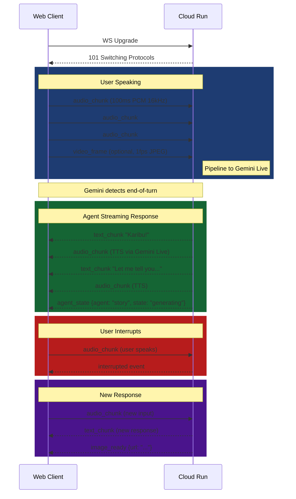

### 7.2 Gemini Live API Integration Pattern

The Orchestrator maintains a persistent Gemini Live WebSocket session
configured with function declarations that map to A2A Task types:

```python
from google import genai
from google.genai import types

client = genai.Client(vertexai=True, project=PROJECT_ID, location=REGION)

config = types.LiveConnectConfig(
    response_modalities=["AUDIO", "TEXT"],
    system_instruction=types.Content(
        parts=[types.Part(text=ORCHESTRATOR_SYSTEM_PROMPT)]
    ),
    tools=[types.Tool(function_declarations=[
        types.FunctionDeclaration(
            name="tell_story",
            description="Generate an African oral tradition story",
            parameters=types.Schema(
                type="OBJECT",
                properties={
                    "culture": types.Schema(type="STRING"),
                    "theme": types.Schema(type="STRING"),
                    "complexity": types.Schema(
                        type="STRING", enum=["child", "teen", "adult"]
                    ),
                },
                required=["culture", "theme"],
            ),
        ),
        types.FunctionDeclaration(
            name="pose_riddle",
            description="Generate an interactive African riddle",
            parameters=types.Schema(
                type="OBJECT",
                properties={
                    "culture": types.Schema(type="STRING"),
                    "difficulty": types.Schema(
                        type="STRING", enum=["easy", "medium", "hard"]
                    ),
                },
                required=["culture"],
            ),
        ),
        types.FunctionDeclaration(
            name="generate_scene_image",
            description="Create a visual of the current story scene",
            parameters=types.Schema(
                type="OBJECT",
                properties={
                    "scene_description": types.Schema(type="STRING"),
                    "culture": types.Schema(type="STRING"),
                },
                required=["scene_description"],
            ),
        ),
        types.FunctionDeclaration(
            name="get_cultural_context",
            description="Get cultural background for a topic",
            parameters=types.Schema(
                type="OBJECT",
                properties={
                    "topic": types.Schema(type="STRING"),
                    "culture": types.Schema(type="STRING"),
                },
                required=["topic"],
            ),
        ),
    ])],
    speech_config=types.SpeechConfig(
        voice_config=types.VoiceConfig(
            prebuilt_voice_config=types.PrebuiltVoiceConfig(
                voice_name="Aoede"
            )
        )
    ),
)

async with client.aio.live.connect(
    model="models/gemini-2.0-flash-live",
    config=config,
) as session:
    # session is now a persistent bidirectional stream
    pass
```

When Gemini detects intent from the user's audio, it emits a `function_call`
event. The Orchestrator intercepts this, creates an A2A Task, validates
the input against the corresponding schema, dispatches to the correct
pipeline, collects the streaming validated output, and sends it back to
Gemini as a `function_response` for natural speech synthesis.

### 7.3 Backpressure Management

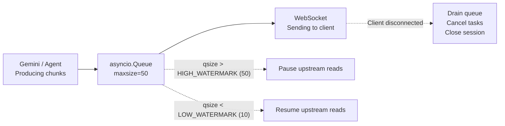

**Implementation**:
```python
async def enqueue_with_backpressure(queue: asyncio.Queue, msg, timeout=5.0):
    try:
        queue.put_nowait(msg)
    except asyncio.QueueFull:
        logger.warning("Backpressure: queue full, waiting")
        try:
            await asyncio.wait_for(queue.put(msg), timeout=timeout)
        except asyncio.TimeoutError:
            logger.error("Backpressure: client too slow, dropping message")
```

### 7.4 Parallel Pipeline Execution

```python
async def handle_story_with_enrichment(request: StoryRequest):
    """
    Run story generation and enrichment in parallel.
    Story streams to user immediately.
    Image generation runs concurrently, result sent when ready.
    Memory persistence is fire-and-forget.
    """
    # Start enrichment in background (non-blocking)
    image_task = asyncio.create_task(
        visual_agent.generate(ImageRequest(
            scene_description=request.theme,
            culture=request.culture,
        ))
    )
    memory_task = asyncio.create_task(
        memory_agent.persist_turn(request)
    )

    # Story pipeline streams to user immediately
    async for validated_chunk in story_pipeline.stream(request):
        yield validated_chunk  # Goes to WebSocket immediately

        # If chunk contains a scene description, update image prompt
        if validated_chunk.get("scene_description"):
            image_task.cancel()
            image_task = asyncio.create_task(
                visual_agent.generate(ImageRequest(
                    scene_description=validated_chunk["scene_description"],
                    culture=request.culture,
                ))
            )

    # Image arrives later as an enhancement
    try:
        image_url = await asyncio.wait_for(image_task, timeout=30.0)
        yield {"type": "image_ready", "url": image_url}
    except (asyncio.TimeoutError, Exception):
        pass  # Non-critical

    # Memory is fire-and-forget
    # No await needed, task completes on its own
```

### 7.5 Latency Breakdown

| Step | Target | Strategy |
|---|---|---|
| WebSocket round-trip | 20ms | Cloud Run regional, same region as Gemini |
| Audio chunk delivery | 10ms | 100ms chunks, pipelined |
| Gemini Live processing | 200-400ms | Streaming, no batching |
| Intent detection | 100-200ms | Detected mid-speech via function calling |
| A2A dispatch + schema validation | 5ms | In-process, jsonschema fast path |
| Sub-agent Gemini call | 150-300ms | Streaming, warm connection pool |
| Cultural grounding (hot path) | 30-50ms | Knowledge base check, no AI call for common patterns |
| Text to client | 10ms | WebSocket push |
| Audio synthesis | 100-200ms | Gemini Live native TTS |
| **Total first-byte** | **400-800ms** | **From end-of-speech** |
| **Perceived latency** | **<500ms** | **Streaming hides processing time** |

---

## 8. Video and Vision Integration

### 8.1 Architecture

Gemini 2.0 Flash Live API supports **multimodal input** including video
frames alongside audio. We use this for optional visual context:

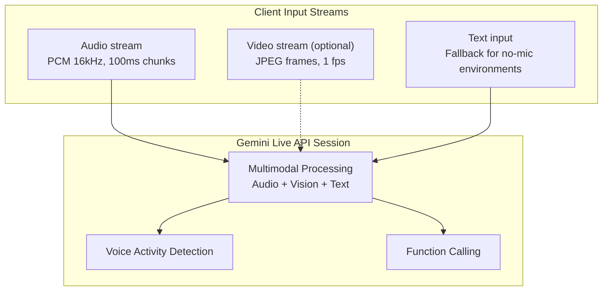

### 8.2 Use Cases for Vision

| Use Case | How It Works |
|---|---|
| User holds up a cultural artifact | Camera frame sent to Gemini Live; it identifies and discusses the object |
| User shows a book cover | Gemini reads the title and offers related stories |
| Classroom setting | Teacher points camera at students; HadithiAI adapts tone for the age group |
| Gesture-based interaction | Thumbs-up to continue, wave to switch topic |

### 8.3 Video Frame Protocol

```json
{
  "type": "video_frame",
  "data": "<base64_jpeg>",
  "width": 640,
  "height": 480,
  "seq": 55
}
```

Frames are sent at 1 fps to minimize bandwidth (approximately 30-50 KB per
frame in JPEG). The Gemini Live API processes them as part of its multimodal
context window alongside the audio stream.

### 8.4 Implementation

```python
async def send_video_frame(self, frame_b64: str):
    """Send a video frame to Gemini Live for visual context."""
    if not self._is_connected:
        return
    try:
        import base64
        frame_bytes = base64.b64decode(frame_b64)
        await self._live.send(
            input=types.LiveClientRealtimeInput(
                media_chunks=[types.Blob(
                    data=frame_bytes,
                    mime_type="image/jpeg",
                )]
            )
        )
    except Exception as e:
        self._logger.warning(f"Failed to send video frame: {e}")
```

---

## 9. Cultural Grounding Layer

### 9.1 Architecture

The Cultural Grounding Agent is the most critical differentiator of
HadithiAI Live. It operates in two modes:

**Hot Path (inline validation)**: Every story/riddle chunk passes through
the cultural agent before reaching the user. This must complete in <50ms
for most chunks. Strategy: knowledge base pattern matching first, AI call
only when confidence is low.

**Cold Path (direct queries)**: When the user explicitly asks about
culture, the agent does a full Gemini call with rich cultural prompting.

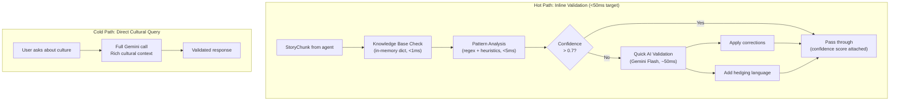

### 9.2 Knowledge Base Structure

```python
CULTURAL_KNOWLEDGE = {
    "story_openings": {
        "swahili": {
            "text": "Hadithi, hadithi!",
            "response": "Hadithi njoo, uwongo njoo, utamu kolea.",
            "translation": "Story, story! Story come, fiction come, let sweetness increase.",
            "verified": True,
        },
        "yoruba": {
            "text": "Alo o!",
            "response": "Alo!",
            "translation": "The traditional Yoruba story opening",
            "verified": True,
        },
        # ... more cultures
    },
    "proverbs": {
        "swahili": [
            {
                "text": "Haraka haraka haina baraka.",
                "translation": "Hurry hurry has no blessing.",
                "verified": True,
                "source": "Common Swahili proverb",
            },
            # ... more proverbs
        ],
    },
    "trickster_figures": {
        "ashanti": {"name": "Anansi", "type": "Spider", "verified": True},
        "yoruba": {"name": "Ijapa", "type": "Tortoise", "verified": True},
        "zulu": {"name": "uNogwaja", "type": "Hare", "verified": True},
    },
}
```

### 9.3 Validation Pipeline

```python
async def validate_chunk(self, chunk: dict) -> dict:
    """
    Validate a StoryChunk against cultural knowledge.
    Returns a ValidatedChunk.

    Performance budget: <50ms for 90% of chunks.
    """
    text = chunk["text"]
    culture = chunk.get("culture", "")
    claims = chunk.get("cultural_claims", [])
    confidence = 1.0
    corrections = []
    rejected = []

    # Level 1: Knowledge base (instant, <1ms)
    for claim in claims:
        kb_result = self._check_knowledge_base(claim, culture)
        if kb_result == "confirmed":
            pass  # Confidence stays high
        elif kb_result == "contradicted":
            confidence *= 0.3
            rejected.append(claim["claim"])
        elif kb_result == "unknown":
            confidence *= 0.85

    # Level 2: Pattern heuristics (<5ms)
    if self._has_overgeneralization(text):
        confidence *= 0.6
        corrections.append("Overly broad cultural claim detected")
    if self._has_culture_mixing(text, culture):
        confidence *= 0.7
        corrections.append("Possible culture mixing detected")

    # Level 3: AI validation (only if confidence < threshold, ~50ms)
    if confidence < 0.7:
        ai_result = await self._quick_ai_validate(text, culture)
        confidence = min(confidence, ai_result.confidence)
        if ai_result.corrected_text:
            text = ai_result.corrected_text
            corrections.extend(ai_result.corrections)

    # Level 4: Apply policy
    if confidence < 0.4:
        text = self._add_hedging(text)

    return {
        "text": text,
        "confidence": confidence,
        "corrections": corrections,
        "rejected_claims": rejected,
        "is_final": chunk.get("is_final", False),
    }
```

---

## 10. Hallucination Mitigation Strategy

### 10.1 Six-Layer Defense

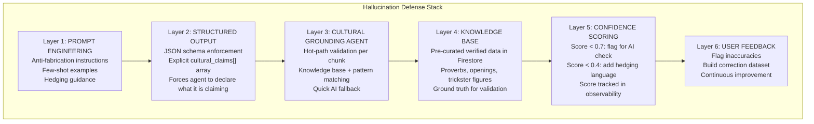

### 10.2 Key Innovation: Explicit Claims Array

The `StoryChunk` schema requires agents to declare their cultural claims
explicitly in a `cultural_claims[]` array. This forces the generating agent
to be conscious of what it is asserting, and gives the Cultural Grounding
Agent a structured list to validate.

Example:
```json
{
  "text": "Anansi the Spider, the great trickster of the Ashanti people, once decided to collect all the wisdom in the world.",
  "culture": "ashanti",
  "cultural_claims": [
    {"claim": "Anansi is a spider trickster figure", "category": "character"},
    {"claim": "Anansi belongs to Ashanti tradition", "category": "character"},
    {"claim": "Anansi is associated with wisdom collection", "category": "historical"}
  ]
}
```

The Cultural Grounding Agent can then validate each claim independently:
- Claim 1: Confirmed (knowledge base)
- Claim 2: Confirmed (knowledge base)
- Claim 3: Confidence 0.85 (known motif but specific wording varies)

### 10.3 What We Do Not Do (and Why)

| Anti-Pattern | Why We Avoid It |
|---|---|
| Full RAG pipeline | Adds 200-500ms latency; incompatible with real-time streaming |
| Post-hoc fact-checking | User already heard the wrong information |
| Multiple model voting | Multiplies latency and cost by 3x |
| Blocking validation | Would destroy streaming smoothness |
| No validation at all | Unacceptable for cultural content |

Our approach: **lightweight inline validation** that adds <50ms for 90%
of chunks while catching the most impactful errors (cultural misattribution,
invented proverbs, culture mixing).

---

## 11. Cloud Run Deployment Architecture

### 11.1 Service Topology

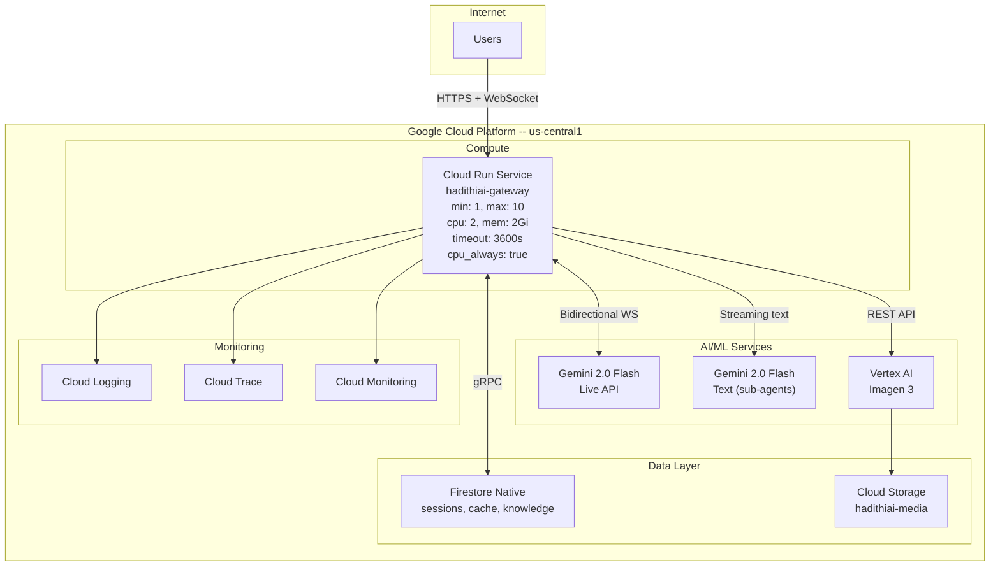

### 11.2 Configuration Rationale

| Setting | Value | Rationale |
|---|---|---|
| `min_instances` | 1 | Eliminates cold start. Always-warm for hackathon demo. |
| `max_instances` | 10 | Sufficient for hackathon scale. |
| `cpu` | 2 | Handles concurrent async tasks (Gemini sessions, agents). |
| `memory` | 2Gi | Supports ~80 concurrent sessions at ~25MB each. |
| `timeout` | 3600 | 1-hour sessions for storytelling. |
| `cpu_always_allocated` | true | Required for WebSocket keep-alive and background tasks. |
| `session_affinity` | true | WebSocket connections stay on the same instance. |
| `startup_cpu_boost` | true | Faster instance initialization. |
| `execution_environment` | gen2 | Full Linux compatibility for SDK dependencies. |

### 11.3 Why Single Service (Not Microservices)

All agents run **in-process** within a single Cloud Run service. This is
a deliberate architectural decision, not a shortcut:

- **Latency**: Inter-agent calls are function calls (nanoseconds), not
  network calls (milliseconds). For a real-time streaming system, this
  difference is critical.
- **Complexity**: No service mesh, no inter-service auth, no distributed
  tracing overhead between services.
- **Cost**: Single service = single billing unit.
- **Correctness**: Agent state (ADK session) is local, avoiding distributed
  state synchronization.

For production at scale, the ADK agent tree can be decomposed into separate
services with A2A protocol handling the inter-service communication. The
A2A JSON contracts we define now make this decomposition straightforward.

### 11.4 Region Selection

| Environment | Region | Rationale |
|---|---|---|
| Hackathon demo | `us-central1` | Lowest latency to Gemini API endpoints |
| Production (Africa) | `africa-south1` | When Gemini Live is available there |
| Production (global) | Multi-region with Cloud CDN | Static assets cached at edge |

---

## 12. Latency Optimization Strategy

### 12.1 Optimization Techniques

**A. Connection Pre-warming**

On WebSocket connect, the Gemini Live session is opened immediately,
before the user speaks. The session is ready when the first audio chunk
arrives.

```python
async def on_client_connect(ws):
    # Open Gemini Live session immediately (do not wait for first message)
    gemini_session = await open_gemini_live_session(
        model="gemini-2.0-flash-live",
        system_instruction=SYSTEM_PROMPT,
        tools=AGENT_TOOLS,
    )
    # Also pre-load cultural knowledge base into memory
    cultural_kb = load_cultural_knowledge()  # Already in dict, instant
```

**B. Speculative Pre-loading**

While the user is still speaking, partial transcripts trigger speculative
pre-loading of cultural context:

```python
async def on_partial_transcript(text: str):
    detected_culture = quick_culture_detect(text)  # Regex-based, <1ms
    if detected_culture:
        asyncio.create_task(preload_cultural_context(detected_culture))
```

**C. Streaming Pipeline (No Batching)**

```python
# WRONG: Wait for full response then send
response = await agent.generate_full_response()
await ws.send(response)

# RIGHT: Stream as tokens arrive
async for chunk in story_pipeline.stream(request):
    validated = await cultural_agent.validate_chunk(chunk)  # <50ms
    await ws.send(validated["text"])  # Immediate
```

**D. Parallel Execution**

Story streaming and image generation run concurrently. The user hears the
story immediately while the image is being generated in the background.

**E. Response Caching**

Known greetings and common patterns are cached for instant response:

```python
GREETING_CACHE = {
    "sw": "Hadithi, hadithi! Hadithi njoo...",
    "yo": "Alo o! Alo!",
    "zu": "Kwesukesukela...",
}
```

**F. Warm Instances**

Cloud Run `min_instances: 1` ensures the Python runtime, all dependencies,
and the Gemini client are pre-loaded.

**G. Client-Side Optimizations**

- Pre-buffer 2 audio chunks before starting playback (smooth audio)
- Use AudioWorklet for low-latency audio rendering
- Decode base64 in a Web Worker (off main thread)
- Use SharedArrayBuffer for zero-copy audio processing where available

### 12.2 Performance Rationale Summary

| Technique | Latency Saved | Why It Matters |
|---|---|---|
| Pre-warmed Gemini session | 500-1000ms | Eliminates session setup from first interaction |
| Speculative cultural pre-load | 30-50ms | Cultural KB ready before intent is confirmed |
| Streaming (no batching) | 300-1000ms perceived | User hears first word before full response exists |
| Parallel image + story | 0ms on critical path | Image never blocks audio |
| Greeting cache | 200-400ms | Instant culturally appropriate first response |
| Warm Cloud Run instance | 2000-5000ms | Eliminates cold start entirely |
| In-process agents (not microservices) | 20-50ms per hop | No network round-trip between agents |

---

## 13. Observability and Monitoring

### 13.1 Structured Logging

Every log entry includes structured fields for Cloud Logging queries:

```python
log_entry = {
    "severity": "INFO",
    "component": "story_agent",
    "event": "chunk_generated",
    "session_id": "abc123",
    "turn_id": "turn_007",
    "agent": "story",
    "latency_ms": 142,
    "tokens_generated": 23,
    "cultural_confidence": 0.92,
    "schema_valid": True,
    "timestamp": "2026-02-22T10:30:00Z",
}
```

### 13.2 Key Metrics

**Latency Metrics:**

| Metric | Description |
|---|---|
| `time_to_first_byte` | WebSocket open to first audio chunk sent to client |
| `gemini_live_latency` | Audio input end to first output token |
| `agent_dispatch_latency` | Intent detected to agent starts generating |
| `cultural_validation_latency` | Chunk received to validated chunk emitted |
| `schema_validation_latency` | Time spent on JSON schema checks |
| `total_turn_latency` | User stops speaking to first audio response |

**Quality Metrics:**

| Metric | Description |
|---|---|
| `cultural_confidence_avg` | Average confidence score per session |
| `schema_violations_count` | A2A schema violations caught per session |
| `hallucination_flags` | Cultural inaccuracies flagged by grounding agent |
| `retry_count` | Schema-enforced retries per session |
| `interruption_count` | User interruptions per session |

**System Metrics:**

| Metric | Description |
|---|---|
| `websocket_connections_active` | Current active WebSocket connections |
| `gemini_live_sessions_active` | Current active Gemini Live sessions |
| `a2a_tasks_in_flight` | A2A tasks currently being processed |
| `backpressure_events` | Queue full moments |
| `circuit_breaker_trips` | Agent circuit breaker activations |
| `error_rate` | Per-component error rate |

### 13.3 Distributed Tracing

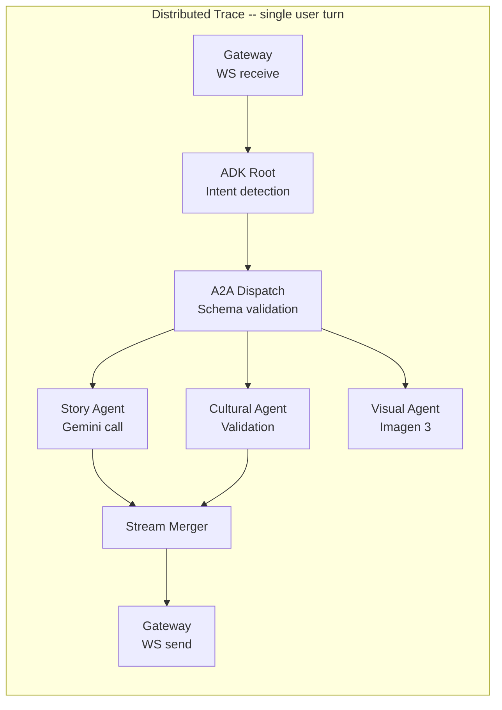

Each span records: duration, token count, error status, schema validation
result, cultural confidence score, agent name.

### 13.4 Cloud Monitoring Dashboard

Key dashboard panels:
- **P50/P90/P99 latency** per component
- **Active sessions** over time
- **Schema violation rate** (should be near zero in steady state)
- **Cultural confidence distribution** (histogram)
- **Error rate** by agent
- **Cloud Run instance count** and CPU utilization

---

## 14. Scaling Strategy

### 14.1 Scaling Configuration

```yaml
# Hackathon (cost-optimized)
min_instances: 1
max_instances: 10
max_concurrent_requests: 80
cpu: 2
memory: 2Gi

# Production (performance-optimized)
min_instances: 3
max_instances: 100
max_concurrent_requests: 50
cpu: 4
memory: 4Gi
```

### 14.2 Bottleneck Analysis

| Bottleneck | Mitigation |
|---|---|
| Gemini API rate limits | Request quota increase; exponential backoff |
| Gemini Live session limit | One session per connection; Cloud Run scaling handles it |
| Firestore write throughput | Async writes; batch where possible |
| Memory per session | ~25MB (ADK session + context); 2Gi supports ~80 sessions |
| CPU for schema validation | jsonschema is fast (<1ms per validation) |

### 14.3 Cost Estimate (Hackathon)

| Resource | Estimate (24h) |
|---|---|
| Cloud Run (1 warm instance) | ~$3-5 |
| Gemini 2.0 Flash Live | ~$0.01/min of conversation |
| Gemini 2.0 Flash Text (sub-agents) | ~$0.005/1K tokens |
| Firestore | ~$0.50 (under free tier) |
| Cloud Storage | ~$0.10 |
| Imagen 3 | ~$0.04/image x 50 = ~$2 |
| **Total** | **~$10-15** |

---

## 15. Fault Tolerance

### 15.1 Failure Modes and Recovery

| Failure | Impact | Recovery |
|---|---|---|
| Gemini Live session drops | No audio I/O | Auto-reconnect with context from Memory; user hears "Let me gather my thoughts..." |
| Sub-agent schema violation | Invalid output | Retry with corrective prompt (up to 2 retries) |
| Sub-agent timeout (>5s) | Slow response | Circuit breaker opens; fallback to direct Gemini response |
| Cultural agent unavailable | No validation | Skip validation; add extra hedging; log warning |
| Image generation fails | No image | Non-critical; continue audio/text; "I could not paint that scene, but imagine..." |
| Firestore write fails | Data loss risk | Queue for retry; session continues with in-memory state |
| WebSocket disconnect | Connection lost | Client auto-reconnects with session token; server restores from Firestore |
| Cloud Run instance crash | Full restart | Stateless design; new instance picks up; client reconnects |

### 15.2 Circuit Breaker

```python
class CircuitBreaker:
    """
    States: CLOSED (healthy) -> OPEN (failing) -> HALF_OPEN (testing)
    Trips after max_failures consecutive failures.
    Resets after reset_timeout seconds.
    """
    def __init__(self, name: str, max_failures: int = 3, reset_timeout: float = 60.0):
        self.name = name
        self.max_failures = max_failures
        self.reset_timeout = reset_timeout
        self.state = "CLOSED"
        self.failure_count = 0
        self.last_failure_time = 0.0

    def is_open(self) -> bool:
        if self.state == "CLOSED":
            return False
        if self.state == "OPEN":
            if time.time() - self.last_failure_time > self.reset_timeout:
                self.state = "HALF_OPEN"
                return False  # Allow one test call
            return True
        return False  # HALF_OPEN allows test call

    def record_failure(self):
        self.failure_count += 1
        self.last_failure_time = time.time()
        if self.failure_count >= self.max_failures:
            self.state = "OPEN"

    def record_success(self):
        self.failure_count = 0
        self.state = "CLOSED"
```

### 15.3 Graceful Degradation

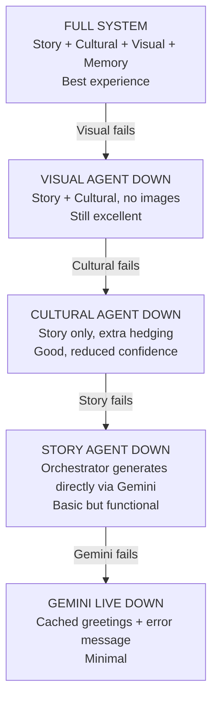

---

## 16. Risk Analysis and Mitigation

### 16.1 Technical Risks

| Risk | Probability | Impact | Mitigation |
|---|---|---|---|
| Gemini Live API rate limit during demo | Medium | Critical | Pre-warm session; request quota increase; have backup recording |
| High latency spikes (>2s) | Medium | High | Streaming hides latency; greeting cache for instant first response |
| Cultural hallucination in live demo | Low | High | Knowledge base for demo cultures (Yoruba, Zulu, Swahili); rehearsed demo path |
| WebSocket drops during demo | Low | High | Auto-reconnect with session restore; session affinity on Cloud Run |
| Imagen 3 quota exhaustion | Low | Low | Image is non-critical; graceful skip |
| Schema validation adds latency | Very Low | Low | jsonschema is <1ms; only AI fallback adds latency |

### 16.2 Operational Risks

| Risk | Mitigation |
|---|---|
| Cost overrun during hackathon | min_instances=1; strict image gen limits; monitoring alerts |
| Demo network issues | Have a backup video recording of the full demo |
| Firestore cold start | Pre-warm with a health check that reads a document |
| Dependency version conflicts | Pin all versions in requirements.txt; Docker build tested |

### 16.3 Cultural Risks

| Risk | Mitigation |
|---|---|
| Cultural misrepresentation | 6-layer hallucination defense; explicit claims array; hedging |
| Culture mixing (e.g., Yoruba proverb attributed to Zulu) | Pattern detection in Cultural Grounding Agent |
| Offensive content generation | Gemini safety filters + Imagen negative prompts + cultural agent |
| Overgeneralization ("All Africans...") | Pattern detection and automatic flagging |

---

## 17. Folder Structure and Best Practices

```
hadithiAI_orchestrator/
|
|-- README.md
|-- requirements.txt
|-- Dockerfile
|-- .env.example
|-- .gitignore
|
|-- docs/
|   +-- ARCHITECTURE.md              <-- This document
|
|-- src/
|   |-- main.py                       <-- FastAPI entry point
|   |
|   |-- core/
|   |   |-- __init__.py
|   |   |-- config.py                 <-- Pydantic settings
|   |   |-- models.py                 <-- All Pydantic data models
|   |   |-- schemas.py                <-- JSON schema definitions (A2A contracts)
|   |   +-- logging_config.py         <-- Structured logging
|   |
|   |-- gateway/
|   |   |-- __init__.py
|   |   |-- websocket_handler.py      <-- WebSocket endpoint
|   |   +-- health.py                 <-- Health probes
|   |
|   |-- orchestrator/
|   |   |-- __init__.py
|   |   |-- primary_orchestrator.py   <-- ADK root agent setup
|   |   |-- a2a_router.py             <-- A2A task routing and schema enforcement
|   |   |-- streaming_controller.py   <-- Output stream management
|   |   +-- circuit_breaker.py        <-- Fault tolerance
|   |
|   |-- agents/
|   |   |-- __init__.py
|   |   |-- base_agent.py             <-- ADK agent base class
|   |   |-- story_agent.py            <-- Story generation (ADK Agent)
|   |   |-- riddle_agent.py           <-- Riddle generation (ADK Agent)
|   |   |-- cultural_agent.py         <-- Cultural grounding (ADK Agent)
|   |   |-- visual_agent.py           <-- Image generation (ADK Agent)
|   |   +-- memory_agent.py           <-- Session memory (ADK Agent)
|   |
|   +-- services/
|       |-- __init__.py
|       |-- gemini_client.py          <-- Gemini Live + Text client
|       |-- firestore_client.py       <-- Firestore operations
|       +-- storage_client.py         <-- Cloud Storage operations
|
|-- static/
|   +-- index.html                    <-- Web client
|
|-- infrastructure/
|   +-- main.tf                       <-- Terraform configuration
|
|-- scripts/
|   |-- deploy.sh
|   +-- deploy.ps1
|
+-- tests/
    |-- test_orchestrator.py
    |-- test_schemas.py               <-- JSON schema contract tests
    |-- test_cultural_agent.py        <-- Cultural validation tests
    +-- test_circuit_breaker.py
```

### Best Practices Applied

| Practice | Implementation |
|---|---|
| Typed contracts | JSON schema on every agent boundary |
| Separation of concerns | Each agent is a standalone module with clear interface |
| Fail-safe defaults | Circuit breakers, graceful degradation, safe fallbacks |
| Observability-first | Structured logging, distributed tracing, metrics on every operation |
| Configuration externalized | Pydantic settings from environment variables |
| Immutable infrastructure | Dockerfile, Terraform, no manual server config |
| Security | Non-root Docker user, no hardcoded secrets, ADC for auth |
| Testing | Unit tests for schemas, circuit breaker, cultural knowledge |

---

## 18. Infrastructure-as-Code

### 18.1 Terraform Resources

```hcl
# Key resources in /infrastructure/main.tf:

# Cloud Run service
google_cloud_run_v2_service.gateway
  min_instance_count = 1
  max_instance_count = 10
  cpu = "2"
  memory = "2Gi"
  timeout = "3600s"
  cpu_idle = false
  startup_cpu_boost = true
  session_affinity = true

# Firestore
google_firestore_database.main
  type = FIRESTORE_NATIVE

# Cloud Storage
google_storage_bucket.media
  lifecycle: delete after 7 days

# APIs enabled
run, firestore, storage, aiplatform, logging, monitoring, cloudtrace
```

### 18.2 Quick Deploy

```bash
gcloud run deploy hadithiai-gateway \
  --source . \
  --region us-central1 \
  --min-instances 1 \
  --max-instances 10 \
  --timeout 3600 \
  --cpu 2 \
  --memory 2Gi \
  --allow-unauthenticated \
  --set-env-vars "HADITHI_PROJECT_ID=$PROJECT_ID,HADITHI_REGION=us-central1" \
  --session-affinity \
  --cpu-boost
```

---

## 19. Hackathon Judges Optimization

### 19.1 Scoring Alignment

| Criteria | Weight | Our Approach |
|---|---|---|
| Innovation (40%) | Highest | First African Oral AI Agent; cultural grounding as architecture; ADK agent hierarchy; A2A protocol |
| Architecture (30%) | High | ADK multi-agent tree; A2A typed contracts; streaming pipeline; fault tolerance |
| Demo (30%) | High | Live voice; interruption; cultural switching; image generation |

### 19.2 What Sets This Apart from Other Entries

1. **Not a chatbot with a system prompt** -- it is a hierarchical agent tree
   with typed communication contracts
2. **Cultural grounding is in the architecture**, not in the prompt
3. **True streaming** with partial output and interruption handling
4. **JSON schema enforcement** means agent outputs are reliable and auditable
5. **Vision support** for multimodal interaction
6. **A2A protocol** enables future decomposition into distributed agents

### 19.3 Demo Script

```
[0:00] Open web client, greet HadithiAI in Swahili
       -> Instant culturally appropriate response (cached greeting)
[0:30] "Tell me a Yoruba trickster story"
       -> Gemini Live function_call -> A2A Task -> Story Pipeline
       -> Streaming audio with cultural grounding validation
[1:30] INTERRUPT mid-story: "Wait, who is Anansi?"
       -> Interruption handled natively
       -> Cultural Agent provides context
[2:00] "Show me the scene"
       -> Visual Agent generates Imagen 3 image (async)
       -> Story continues while image loads
[2:30] "Give me a riddle"
       -> Riddle Pipeline: structured output with hints
       -> Multi-turn interaction
[3:30] Switch to Zulu tradition
       -> Cultural adaptation with new openings and proverbs
[4:00] End with a proverb exchange

Total: 4 minutes. All agents demonstrated. Streaming + interruption visible.
```

---

## Appendix A: Key API References

- [Google ADK Documentation](https://google.github.io/adk-docs/)
- [Agent-to-Agent Protocol](https://google.github.io/A2A/)
- [Gemini Live API (Multimodal Live)](https://ai.google.dev/api/multimodal-live)
- [Vertex AI Imagen 3](https://cloud.google.com/vertex-ai/docs/generative-ai/image/generate-images)
- [Cloud Run WebSocket support](https://cloud.google.com/run/docs/triggering/websockets)
- [Firestore Python client](https://cloud.google.com/python/docs/reference/firestore/latest)

---

*Document Version: 3.0*
*Last Updated: 2026-02-22*
*Author: Abraham Imani Bahati*
