# 🌍 HadithiAI Live – Architecture Document
## The First African Immersive Oral AI Agent
### Production-Grade System Architecture v2.0

---

## Table of Contents

1. [Executive Summary](#1-executive-summary)
2. [System Architecture Overview](#2-system-architecture-overview)
3. [Architecture Diagrams](#3-architecture-diagrams)
4. [Component Deep Dive](#4-component-deep-dive)
5. [Execution Flow](#5-execution-flow)
6. [Streaming Architecture](#6-streaming-architecture)
7. [Google Cloud Deployment Architecture](#7-google-cloud-deployment-architecture)
8. [Latency Optimization Strategy](#8-latency-optimization-strategy)
9. [Prompt Engineering Strategy](#9-prompt-engineering-strategy)
10. [Hallucination Mitigation Strategy](#10-hallucination-mitigation-strategy)
11. [Observability & Logging](#11-observability--logging)
12. [Scaling Strategy](#12-scaling-strategy)
13. [Fault Tolerance](#13-fault-tolerance)
14. [Infrastructure-as-Code](#14-infrastructure-as-code)
15. [Hackathon Judges Optimization](#15-hackathon-judges-optimization)

---

## 1. Executive Summary

**HadithiAI Live** is a real-time, multimodal, multi-agent oral storytelling system
rooted in African cultural traditions. It uses Google's Gemini Live API for
bidirectional audio/text streaming, orchestrates multiple specialized AI agents,
and delivers immersive cultural experiences with sub-second latency.

### Key Differentiators
- **First-of-its-kind**: African oral tradition meets real-time AI
- **True bidirectional streaming**: Not request/response — continuous conversation
- **Multi-agent hierarchy**: Orchestrator delegates to specialized cultural agents
- **Cultural grounding**: Every response is validated against authentic African traditions
- **Interruption-native**: Users can interrupt mid-story, just like real oral tradition

### Technology Stack
| Layer | Technology |
|-------|-----------|
| Frontend | Web client (HTML5 + WebSocket) |
| Gateway | Cloud Run (WebSocket-enabled) |
| Orchestrator | Python async (Cloud Run) |
| AI Engine | Gemini 2.0 Flash Live API |
| Sub-Agents | Gemini 2.0 Flash (text) |
| Image Gen | Imagen 3 via Vertex AI |
| Database | Firestore (session/memory) |
| Storage | Cloud Storage (audio/images) |
| Observability | Cloud Logging + Cloud Trace |
| IaC | Terraform |

---

## 2. System Architecture Overview

### Architectural Pattern: Hierarchical Agent Orchestration

The system follows a **Central Orchestrator Agent** pattern where a primary
orchestrator manages conversation state, detects intent, delegates to specialized
sub-agents, merges their outputs, and streams partial responses back to the user.

```mermaid
block-beta
  columns 1
  block:layers["🏛️ ARCHITECTURAL LAYERS"]
    L1["L1 · Client Layer — WebSocket Audio/Text Client"]
    L2["L2 · Gateway Layer — Cloud Run WebSocket Gateway"]
    L3["L3 · Orchestration Layer — Primary Orchestrator Agent"]
    L4["L4 · Agent Layer — Specialized Sub-Agents"]
    L5["L5 · AI Layer — Gemini Live API + Vertex AI"]
    L6["L6 · Persistence Layer — Firestore + Cloud Storage"]
    L7["L7 · Observability Layer — Logging + Tracing + Metrics"]
  end
```

### Core Design Principles

1. **Stream-First**: Every component is designed for streaming, never batch
2. **Async-Native**: All I/O is non-blocking via Python asyncio
3. **Event-Driven**: Components communicate via async event queues
4. **Fail-Graceful**: Sub-agent failure never crashes the conversation
5. **Culture-Anchored**: Cultural grounding is not optional — it's in the hot path

---

## 3. Architecture Diagrams

### 3.1 High-Level Cloud Architecture

```mermaid
graph TB
  subgraph CLIENT["🌐 Client Layer"]
    WebClient["🎤 Web Client<br/>Audio + Text + Vision"]
  end

  subgraph GCP["☁️ Google Cloud Platform"]
    subgraph CR["🚀 Cloud Run Service"]
      Gateway["🔌 Gateway<br/>WebSocket Endpoint<br/>Connection Manager<br/>Backpressure Control"]
      Orchestrator["🧠 Primary Orchestrator<br/>Intent Detector<br/>Response Merger<br/>Stream Controller"]
      Dispatcher["📡 Agent Dispatcher"]
    end

    subgraph AI["🤖 AI Services"]
      GeminiLive["⚡ Gemini 2.0 Flash<br/>Live API<br/>Bidirectional Streaming"]
      GeminiText["📝 Gemini 2.0 Flash<br/>Text Generation"]
      Imagen["🎨 Vertex AI<br/>Imagen 3"]
    end

    subgraph STORAGE["💾 Persistence"]
      Firestore["🗄️ Firestore<br/>Sessions · History · Cache"]
      CloudStorage["📦 Cloud Storage<br/>Images · Audio · Assets"]
    end

    subgraph OBS["📊 Observability"]
      Logging["Cloud Logging"]
      Trace["Cloud Trace"]
      Monitor["Cloud Monitoring"]
    end
  end

  WebClient <-->|"WebSocket<br/>Audio + Text + Events"| Gateway
  Gateway <--> Orchestrator
  Orchestrator <--> Dispatcher
  Orchestrator <-->|"Persistent WS Session"| GeminiLive
  Dispatcher -->|"Streaming Requests"| GeminiText
  Dispatcher -->|"Async Image Gen"| Imagen
  Orchestrator --> Firestore
  Imagen --> CloudStorage
  CR --> OBS
```

### 3.2 Multi-Agent Orchestration Diagram

```mermaid
graph TB
  subgraph ORCH["🧠 PRIMARY ORCHESTRATOR"]
    direction TB
    Intent["🎯 Intent Detector<br/>Gemini Live Function Calling"]
    Merger["🔀 Response Merger &<br/>Stream Controller"]
    Dispatch["📡 Agent Dispatcher<br/>Routes · Merges · Circuit Breaks"]
    Intent --> Dispatch
    Dispatch --> Merger
  end

  subgraph AGENTS["🎭 Specialized Sub-Agents"]
    Story["📖 Story Agent<br/>Oral tradition stories<br/>Streams paragraphs<br/>Adapts tone"]
    Riddle["🧩 Riddle Agent<br/>Interactive riddles<br/>Hints & scoring<br/>Multi-turn"]
    Cultural["🌍 Cultural Grounding<br/>Validates accuracy<br/>Enriches context<br/>🔥 HOT PATH"]
    Visual["🎨 Visual Agent<br/>Imagen 3 scenes<br/>Async generation<br/>Non-blocking"]
    Memory["🧠 Memory Manager<br/>Session state<br/>History · 20 turns<br/>User preferences"]
  end

  subgraph BACKENDS["⚙️ Backend Services"]
    Gemini["⚡ Gemini 2.0 Flash Live"]
    GeminiSub["📝 Gemini 2.0 Flash · Text"]
    VertexAI["🎨 Vertex AI Imagen 3"]
    FS["🗄️ Firestore + Cloud Storage"]
  end

  Dispatch --> Story
  Dispatch --> Riddle
  Dispatch --> Cultural
  Dispatch --> Visual
  Dispatch --> Memory

  Story -->|"Streaming text"| GeminiSub
  Riddle -->|"Structured generation"| GeminiSub
  Cultural -->|"Lightweight validation"| GeminiSub
  Visual -->|"Image generation"| VertexAI
  Memory -->|"CRUD"| FS

  Story -.->|"Each chunk"| Cultural
  Cultural -.->|"Validated chunk"| Merger
```

### 3.3 Real-Time Streaming Flow

```mermaid
graph LR
  subgraph INPUT["🎤 Input Pipeline"]
    Mic["Microphone<br/>PCM 16kHz"]
    WS1["WebSocket<br/>audio_chunk msgs"]
    GW1["Gateway<br/>Input Queue"]
  end

  subgraph PROCESSING["⚡ Processing Pipeline"]
    Gemini["Gemini Live API<br/>VAD + Transcription<br/>+ Intent Detection"]
    FC["Function Call<br/>tell_story / pose_riddle"]
    Agent["Sub-Agent<br/>Streaming Generation"]
    Validate["Cultural Grounding<br/>Chunk Validation"]
  end

  subgraph OUTPUT["🔊 Output Pipeline"]
    Buffer["Streaming Controller<br/>Sentence Boundary Buffer"]
    WS2["WebSocket<br/>text + audio chunks"]
    Speaker["Speaker / Display<br/>Audio + Text + Images"]
  end

  Mic -->|"100ms chunks"| WS1
  WS1 -->|"10/sec"| GW1
  GW1 -->|"Pipe"| Gemini
  Gemini -->|"Intent"| FC
  FC -->|"Dispatch"| Agent
  Agent -->|"Text chunks"| Validate
  Validate -->|"Validated"| Buffer
  Buffer -->|"Sentence-aligned"| WS2
  WS2 -->|"Interleaved<br/>text + audio"| Speaker
```

### 3.4 Sequence Diagram — Live Interaction

```mermaid
sequenceDiagram
  actor User as 👤 User
  participant Client as 🌐 Web Client
  participant Gateway as 🔌 Cloud Run Gateway
  participant Orch as 🧠 Orchestrator
  participant Gemini as ⚡ Gemini Live API
  participant Story as 📖 Story Agent
  participant Culture as 🌍 Cultural Agent
  participant Visual as 🎨 Visual Agent
  participant DB as 🗄️ Firestore

  Note over User,DB: 🔗 CONNECTION ESTABLISHMENT
  Client->>Gateway: WebSocket Upgrade
  Gateway->>DB: Create session
  Gateway->>Orch: Initialize Orchestrator
  Orch->>Gemini: Open persistent Live session

  Note over User,DB: 🎤 USER SPEAKS
  User->>Client: Speaks (audio)
  loop Every 100ms
    Client->>Gateway: audio_chunk (PCM 16kHz)
    Gateway->>Orch: Forward to input queue
    Orch->>Gemini: Pipe audio stream
  end

  Note over User,DB: 🎯 INTENT DETECTION + AGENT DISPATCH
  Gemini-->>Orch: Function call: tell_story(culture="yoruba", theme="trickster")
  Orch->>Story: Dispatch with context
  Orch->>Visual: Generate scene (async, non-blocking)

  Note over User,DB: 📖 STREAMING RESPONSE
  loop Streaming chunks
    Story-->>Culture: Text chunk
    Culture-->>Orch: ✅ Validated chunk
    Orch-->>Gateway: text_chunk + audio_chunk
    Gateway-->>Client: Stream to user
    Client-->>User: 🔊 Play audio + display text
  end

  Note over User,DB: ✋ USER INTERRUPTS
  User->>Client: Speaks mid-response
  Client->>Gateway: audio_chunk (interrupt)
  Gemini-->>Orch: interrupt signal
  Orch->>Story: Cancel current task
  Orch-->>Gateway: { type: "interrupted" }
  Orch->>Gemini: Process new input with context

  Note over User,DB: 🖼️ ASYNC IMAGE ARRIVES
  Visual-->>Gateway: image_ready { url: "..." }
  Gateway-->>Client: Display image

  Note over User,DB: 💾 SESSION PERSISTENCE
  Orch->>DB: Save turn (async, non-blocking)
```

---

## 4. Component Deep Dive

### 4.1 Cloud Run Gateway

**Purpose**: WebSocket termination point, connection lifecycle management.

**Key Responsibilities**:
- Accept and maintain WebSocket connections (Cloud Run supports WebSocket natively)
- Lightweight session token validation (no heavy auth — hackathon-appropriate)
- Apply backpressure when downstream is slow
- Route audio chunks to the Orchestrator's input queue
- Forward Orchestrator output chunks to the client

**Configuration**:
```yaml
# Cloud Run service config
min_instances: 1          # Always warm (critical for latency)
max_instances: 10         # Scale for hackathon demo
timeout: 3600             # 1hr for long storytelling sessions
concurrency: 100          # Multiple WebSocket connections per instance
cpu_always_allocated: true # Required for WebSocket keep-alive
```

**Why Cloud Run for WebSocket?**
- Cloud Run supports HTTP/2 and WebSocket natively since 2021
- With `cpu_always_allocated: true`, it can maintain long-lived connections
- Serverless scaling without managing infrastructure
- Cost-effective for hackathon budgets

---

### 4.2 Primary Orchestrator Agent

**Purpose**: The brain of the system. Manages conversation flow, detects intent,
dispatches to sub-agents, merges results, and controls streaming output.

**Key Responsibilities**:
- Maintain conversation state machine
- Detect user intent from streaming audio/text via Gemini Live
- Route to appropriate sub-agent(s) — can invoke multiple in parallel
- Merge sub-agent outputs into coherent streaming response
- Handle user interruptions gracefully
- Manage turn-taking in conversation

**State Machine**:


**Interruption Handling Strategy**:
The Gemini Live API natively supports interruption. When the user starts speaking
while the agent is responding:
1. Orchestrator receives `interrupted` event from Gemini Live
2. Current sub-agent output is cancelled (asyncio task cancellation)
3. State transitions to INTERRUPTED → LISTENING
4. New user input is processed with context of what was already said
5. This mirrors real oral tradition where listeners interject naturally

---

### 4.3 Story Agent

**Purpose**: Generates culturally-rooted African stories with oral tradition style.

**Capabilities**:
- Generate original stories inspired by African oral traditions
- Adapt story tone/complexity based on user preferences
- Stream story paragraph-by-paragraph for natural pacing
- Support story continuation ("tell me more", "what happened next?")
- Embed cultural elements (proverbs, moral lessons, call-and-response)

**Streaming Strategy**:
- Stories are generated in semantic chunks (sentences/paragraphs)
- Each chunk is sent as soon as available (no buffering full story)
- Cultural grounding agent validates each chunk in parallel
- Audio synthesis happens per-chunk for minimal latency

---

### 4.4 Riddle Agent

**Purpose**: Generates and manages interactive African riddles.

**Capabilities**:
- Generate riddles from various African cultural traditions
- Manage riddle state (posed → hint → answer → explanation)
- Score user attempts
- Provide culturally contextual hints
- Support multi-turn riddle sessions

**Interaction Flow**:
```
Agent: "I have a riddle from the Kikuyu people..."
User: "Let me hear it!"
Agent: "What has a head and a tail but no body?"
User: "Is it a snake?"
Agent: "Good guess! Here's a hint — it jingles..."
User: "A coin!"
Agent: "Yes! In Kikuyu tradition, riddles teach..."
```

---

### 4.5 Cultural Grounding Agent

**Purpose**: Validates and enriches all outputs with authentic cultural context.

**This is the KEY differentiator — it sits in the HOT PATH.**

**Capabilities**:
- Validate cultural accuracy of generated content
- Enrich responses with cultural context (language, geography, customs)
- Map story elements to specific African traditions
- Detect and correct cultural hallucinations
- Add appropriate greetings, proverbs, and phrases in local languages

**Integration Point — Cultural Validation Pipeline**:

```mermaid
graph LR
  A["📖 Story Agent<br/>Output Chunk"] --> B["🌍 Cultural Grounding<br/>Agent"]
  B --> C{"✅ Valid?"}
  C -->|"Yes"| D["🔊 Stream to User"]
  C -->|"Needs Fix"| E["✏️ Correct & Enrich"]
  E --> D
  C -->|"❌ Low Confidence"| F["🛡️ Add Hedging Language"]
  F --> D
```

For streaming, it validates chunk-by-chunk with a small lookahead buffer
to avoid blocking the stream while still catching issues.

---

### 4.6 Visual Generation Agent

**Purpose**: Generate scene illustrations for stories using Imagen 3.

**Capabilities**:
- Generate images depicting story scenes
- Create cultural artifact visualizations
- Produce riddle illustrations
- Generate character portraits in African art styles

**Integration**:
- Runs ASYNCHRONOUSLY — never blocks the audio/text stream
- Images are generated in background, URL sent to client when ready
- Uses Cloud Storage for generated image hosting
- Prompt is crafted by the Orchestrator based on story context

**Latency Note**:
Image generation is 5–15 seconds. This is fine because:
1. It runs in parallel with audio/text streaming
2. Client receives image URL as a "bonus" enhancement
3. Never blocks the conversation flow

---

### 4.7 Memory Manager

**Purpose**: Manage session state, conversation history, and user preferences.

**Storage Strategy**:

```mermaid
graph TD
  subgraph FIRESTORE["🗄️ Firestore Structure"]
    Sessions["📂 sessions/"]
    Session["📄 session_id"]
    Meta["metadata<br/>created_at · last_active · language_pref"]
    Convo["📂 conversation/ sub-collection"]
    Turn1["turn_001 — role · content · timestamp · agent"]
    Turn2["turn_002"]
    TurnN["..."]
    Prefs["preferences — age_group · language · region · themes"]
    StoryState["story_state — current_story · progress · characters"]
    Cache["📂 cache/"]
    Stories["📂 stories/"]
    CacheEntry["culture_theme — Pre-generated fragments"]
  end

  Sessions --> Session
  Session --> Meta
  Session --> Convo
  Convo --> Turn1
  Convo --> Turn2
  Convo --> TurnN
  Session --> Prefs
  Session --> StoryState
  Cache --> Stories
  Stories --> CacheEntry
```

**Session Strategy (No Heavy Auth)**:
- Generate a random session token on first connection
- Store in client localStorage
- Token = Firestore document ID
- No email/password — frictionless for hackathon demo
- Sessions expire after 24 hours (Firestore TTL)

**Memory Window**:
- Keep last 20 conversation turns in active memory
- Summarize older turns using Gemini (background task)
- This prevents context window overflow while maintaining continuity

---

### 4.8 Streaming Controller

**Purpose**: Manages the output stream — buffering, pacing, and backpressure.

**Key Mechanisms**:

1. **Token Buffering**: Accumulate tokens until a semantic boundary
   (sentence end, paragraph break) before flushing to audio synthesis
2. **Backpressure**: If client can't consume fast enough, slow the generator
3. **Priority Queue**: Interruption events have highest priority
4. **Interleaving**: Text chunks and audio chunks are interleaved on the
   same WebSocket with message type headers

**Message Protocol**:
```json
// Client → Server
{ "type": "audio_chunk", "data": "<base64_pcm_16khz>", "seq": 42 }
{ "type": "text_input", "data": "Tell me a story", "seq": 43 }
{ "type": "interrupt", "seq": 44 }
{ "type": "control", "action": "set_language", "value": "sw" }

// Server → Client
{ "type": "audio_chunk", "data": "<base64_pcm_24khz>", "seq": 100 }
{ "type": "text_chunk", "data": "Once upon a time...", "seq": 101 }
{ "type": "image_ready", "url": "https://storage.../scene1.png", "seq": 102 }
{ "type": "agent_state", "agent": "story", "state": "generating" }
{ "type": "turn_end", "seq": 103 }
```

---

## 5. Execution Flow

### 5.1 Complete Request Lifecycle

```mermaid
graph TD
  subgraph S1["1️⃣ CONNECTION"]
    C1["Client → WebSocket → Cloud Run"]
    C2["Create session in Firestore"]
    C3["Open Gemini Live session<br/>persistent for entire conversation"]
    C1 --> C2 --> C3
  end

  subgraph S2["2️⃣ USER SPEAKS"]
    U1["Capture audio · PCM 16kHz · 100ms chunks"]
    U2["10 audio_chunk messages/sec"]
    U3["Gateway → Orchestrator → Gemini Live"]
    U1 --> U2 --> U3
  end

  subgraph S3["3️⃣ INTENT DETECTION"]
    I1["Gemini processes audio in real-time"]
    I2["Streams transcription + intent"]
    I3["Pre-load sub-agent context"]
    I1 --> I2 --> I3
  end

  subgraph S4["4️⃣ AGENT DISPATCH"]
    D1{"Intent Router"}
    D2["request_story → Story + Cultural"]
    D3["request_riddle → Riddle + Cultural"]
    D4["describe_scene → Visual · async"]
    D1 --> D2
    D1 --> D3
    D1 --> D4
  end

  subgraph S5["5️⃣ STREAMING RESPONSE"]
    R1["Sub-Agent streams text chunks"]
    R2["Cultural Agent validates each chunk"]
    R3["Stream Controller · sentence-aligned"]
    R4["WebSocket → Audio + Text interleaved"]
    R1 --> R2 --> R3 --> R4
  end

  subgraph S6["6️⃣ INTERRUPTION"]
    INT1["User speaks mid-response"]
    INT2["Gemini VAD → interrupt signal"]
    INT3["Cancel tasks · pivot to new input"]
    INT1 --> INT2 --> INT3
  end

  S1 --> S2 --> S3 --> S4 --> S5
  S5 -.->|"If user interrupts"| S6
  S6 -.->|"Process new input"| S3
```

### 5.2 Latency Breakdown Per Step

| Step | Target Latency | Strategy |
|------|---------------|----------|
| WebSocket round-trip | ~20ms | Cloud Run regional |
| Audio chunk delivery | ~10ms | 100ms chunks, pipelined |
| Gemini Live processing | ~200-400ms | Streaming, no batching |
| Intent detection | ~100-200ms | Detected mid-speech |
| Agent dispatch | ~5ms | In-process routing |
| Sub-agent Gemini call | ~150-300ms | Streaming, warm connection |
| Cultural grounding | ~50-100ms | Lightweight validation |
| Text → client | ~10ms | WebSocket push |
| Audio synthesis | ~100-200ms | Gemini Live native TTS |
| **TOTAL first-byte** | **~400-800ms** | **From end-of-speech** |

---

## 6. Streaming Architecture

### 6.1 WebSocket Protocol Design


### 6.2 Gemini Live API Integration

The Gemini Live API (also called the Multimodal Live API) provides **bidirectional
streaming** over WebSocket. Key properties:

- **Input**: Stream audio (PCM 16kHz) + text in real-time
- **Output**: Receive audio (PCM 24kHz) + text simultaneously
- **Interruption**: Built-in voice activity detection (VAD)
- **Session**: Persistent connection for entire conversation
- **Function Calling**: Can invoke tools mid-conversation (we use this for agent dispatch)

**Our Integration Pattern**:

```mermaid
graph LR
  A["🌐 Client<br/>WebSocket"] <-->|"Audio + Text"| B["🔌 Cloud Run<br/>Gateway"]
  B <--> C["🧠 Orchestrator"]
  C <-->|"Persistent WS"| D["⚡ Gemini Live API"]
  C -->|"Function Calls"| E["🎭 Sub-Agents"]
  E -->|"Results"| C
```

The Orchestrator maintains a persistent Gemini Live API WebSocket session.
It configures Gemini with **function declarations** for each sub-agent:

```python
tools = [
    {
        "function_declarations": [
            {
                "name": "tell_story",
                "description": "Generate an African oral tradition story",
                "parameters": {
                    "type": "object",
                    "properties": {
                        "culture": { "type": "string" },
                        "theme": { "type": "string" },
                        "complexity": { "type": "string", "enum": ["child", "teen", "adult"] }
                    }
                }
            },
            {
                "name": "pose_riddle",
                "description": "Generate an African cultural riddle",
                "parameters": { ... }
            },
            {
                "name": "generate_scene_image",
                "description": "Create a visual of the current story scene",
                "parameters": { ... }
            },
            {
                "name": "get_cultural_context",
                "description": "Get cultural background for a topic",
                "parameters": { ... }
            }
        ]
    }
]
```

When Gemini detects the user wants a story, it calls `tell_story()` as a function
call. The Orchestrator intercepts this, routes to the Story Agent, and streams
the result back through Gemini for natural speech synthesis.

### 6.3 Backpressure Management

```mermaid
graph LR
  Producer["⚡ Producer<br/>Gemini"] --> Buffer["📦 Buffer<br/>asyncio.Queue"]
  Buffer --> Consumer["🌐 Consumer<br/>WebSocket"]
  Buffer -.->|"> HIGH_WATERMARK · 50"| Pause["⏸️ Pause Gemini reads"]
  Buffer -.->|"< LOW_WATERMARK · 10"| Resume["▶️ Resume Gemini reads"]
  Consumer -.->|"Disconnected"| Drain["🗑️ Drain · Cancel · Close"]
```

### 6.4 Audio Streaming Optimization

| Optimization | Impact |
|-------------|--------|
| PCM format (no encoding overhead) | -5ms per chunk |
| 100ms chunk size (sweet spot) | Balance latency/overhead |
| Pre-buffer 2 chunks on client | Smooth playback |
| Opus encoding for bandwidth | -60% bandwidth (optional) |
| Jitter buffer on client | Smooth audio despite network |

---

## 7. Google Cloud Deployment Architecture

### 7.1 Service Topology

```mermaid
graph TB
  subgraph INTERNET["🌍 Internet"]
    Users["👤 Users"]
  end

  subgraph GCP["☁️ Google Cloud Platform · us-central1"]
    subgraph COMPUTE["🚀 Compute"]
      CloudRun["Cloud Run Service<br/><b>hadithiai-gateway</b><br/>min: 1 · max: 10<br/>cpu: 2 · mem: 2Gi<br/>timeout: 3600s<br/>cpu_always: true"]
    end

    subgraph AIML["🤖 AI / ML"]
      GeminiLive2["Gemini 2.0 Flash<br/>Live API"]
      Imagen2["Vertex AI<br/>Imagen 3"]
    end

    subgraph DATA["💾 Data"]
      FS2["Firestore · Native<br/>sessions · cache"]
      GCS["Cloud Storage<br/>hadithiai-media"]
    end

    subgraph MONITOR["📊 Monitoring"]
      CL["Cloud Logging"]
      CT["Cloud Trace"]
      CM["Cloud Monitoring"]
    end
  end

  Users -->|"HTTPS + WebSocket"| CloudRun
  CloudRun <-->|"Bidirectional WS"| GeminiLive2
  CloudRun -->|"REST API"| Imagen2
  CloudRun <-->|"gRPC"| FS2
  Imagen2 -->|"Store images"| GCS
  CloudRun --> CL
  CloudRun --> CT
  CloudRun --> CM
```

### 7.2 Why This Architecture?

| Decision | Rationale |
|----------|-----------|
| Single Cloud Run service | Minimizes network hops. Sub-agents run in-process as async tasks, not separate services. Critical for latency. |
| min_instances: 1 | Eliminates cold start. Always-warm instance for demo. |
| cpu_always_allocated | Required for WebSocket and background async work. |
| Firestore Native | Sub-millisecond reads, real-time listeners, serverless. |
| Same region for all services | Eliminates cross-region latency. |
| In-process agents | No inter-service network calls. Agents are Python modules, not microservices. Deliberate hackathon optimization. |

### 7.3 Region Selection Strategy

**For hackathon demo**: `us-central1` (lowest latency to Gemini API)
**For production**: `africa-south1` (Johannesburg) when Gemini Live is available there

The Gemini Live API endpoint is in US regions. To minimize latency:
- Deploy Cloud Run in same region as Gemini API endpoint
- For African users in production, use Cloud CDN for static assets
  and accept the API latency until African endpoints are available

---

## 8. Latency Optimization Strategy

### 8.1 Realistic Latency Analysis

**True zero latency is physically impossible.** Here's a realistic breakdown:

| Component | Min Latency | Our Target |
|-----------|------------|------------|
| Network (client → Cloud Run) | 20-80ms | ~30ms (same continent) |
| WebSocket overhead | 1-2ms | ~2ms |
| Audio buffering (client) | 100ms | 100ms (1 chunk) |
| Gemini Live processing | 200-500ms | ~300ms (streaming) |
| Sub-agent processing | 50-200ms | ~100ms (streaming) |
| Audio synthesis (TTS) | 100-300ms | ~150ms (Gemini native) |
| Network (Cloud Run → client) | 20-80ms | ~30ms |
| Client audio playback buffer | 100-200ms | ~100ms |
| **TOTAL end-to-end** | **~600-1500ms** | **~800ms target** |
| **PERCEIVED latency** | **~400-800ms** | **~500ms (streaming)** |

**The key insight**: With streaming, the user perceives latency as **time to first
audio byte**, not total processing time. We optimize for first-byte latency.

### 8.2 Optimization Techniques

#### A. Connection Pre-warming
```python
# On WebSocket connect, immediately open Gemini Live session
# Don't wait for first user message
async def on_client_connect(ws):
    gemini_session = await open_gemini_live_session(
        model="gemini-2.0-flash-live",
        system_instruction=SYSTEM_PROMPT,
        tools=AGENT_TOOLS,
    )
    # Session is ready before user speaks
```

#### B. Speculative Pre-loading
```python
# While user is still speaking, pre-load cultural context
async def on_partial_transcript(text):
    detected_culture = quick_culture_detect(text)
    if detected_culture:
        asyncio.create_task(preload_cultural_context(detected_culture))
```

#### C. Streaming Pipeline (No Batching)
```python
# WRONG: Wait for full response then send
response = await agent.generate_full_response()
await ws.send(response)

# RIGHT: Stream as tokens arrive
async for chunk in agent.generate_stream():
    validated = await cultural_agent.quick_validate(chunk)
    await ws.send(validated)  # Send immediately
```

#### D. Parallel Agent Execution
```python
# When a story needs cultural grounding + visual:
story_task = asyncio.create_task(story_agent.generate(prompt))
visual_task = asyncio.create_task(visual_agent.generate(scene))

# Story streams to user immediately
# Visual runs in background, sent when ready
async for chunk in story_task:
    yield chunk

# Image arrives later as a bonus
image_url = await visual_task
yield {"type": "image_ready", "url": image_url}
```

#### E. Warm Instances
```yaml
# Cloud Run always keeps 1 instance warm
min_instances: 1
# This instance has: Python runtime loaded, dependencies imported,
# Gemini client initialized, cultural knowledge base in memory
```

#### F. Response Caching
```python
GREETING_CACHE = {
    "sw": "Hadithi, hadithi! Hadithi njoo...",  # Swahili
    "yo": "Àlọ́ o! Àlọ́...",                     # Yoruba
    "zu": "Kwesukesukela...",                     # Zulu
}
# Instant response for known patterns, then stream the rest
```

#### G. Client-Side Optimizations
```javascript
// Pre-buffer audio: start playback after 2 chunks received
// Use AudioWorklet for low-latency audio playback
// Use SharedArrayBuffer for zero-copy audio processing
// Decode base64 audio in Web Worker (off main thread)
```

---

## 9. Prompt Engineering Strategy

### 9.1 System Prompt (Orchestrator / Gemini Live Session)

```
You are HadithiAI, the world's first African Immersive Oral AI Agent.

IDENTITY:
- You are a master storyteller (Griot) in the African oral tradition
- You speak with warmth, rhythm, and cultural authenticity
- You naturally use call-and-response patterns
- You weave proverbs and wisdom into conversation
- You adapt your language and tone to the listener

BEHAVIOR:
- Begin conversations with a culturally appropriate greeting
- Always ground stories in specific African cultures (name them)
- Use traditional story openings from the relevant culture
- Include moral lessons naturally, never forced
- Encourage listener participation (questions, responses)
- If interrupted, gracefully incorporate the interruption

TOOLS:
- Use tell_story() when the user wants a story
- Use pose_riddle() when the user wants a riddle or game
- Use generate_scene_image() to create visuals for key moments
- Use get_cultural_context() when you need cultural details

CONSTRAINTS:
- Never fabricate cultural facts — use get_cultural_context() if unsure
- Never mix cultures inappropriately
- Always credit the cultural origin of stories and riddles
- Keep responses conversational, not academic
- Maintain the oral tradition feel — this is spoken, not written

LANGUAGE:
- Default to English with cultural phrases mixed in
- If the user speaks Swahili, Yoruba, Zulu, or other African languages,
  respond in that language with English support
- Use phonetic pronunciation guides for non-English phrases
```

### 9.2 Story Agent Prompt Template

```
ROLE: You are the Story Generation Agent of HadithiAI.

TASK: Generate an immersive African oral tradition story.

CONTEXT:
- Culture: {culture}
- Theme: {theme}
- Audience: {age_group}
- Session history: {summary_of_conversation}
- User preferences: {preferences}

STORY REQUIREMENTS:
1. Begin with the traditional opening of the {culture} tradition
2. Include 2-3 culturally authentic characters
3. Embed at least one proverb from the {culture} tradition
4. Include a call-and-response moment (mark with [CALL_RESPONSE])
5. Build to a moral lesson that emerges naturally
6. End with the traditional closing of the {culture} tradition

STREAMING INSTRUCTIONS:
- Generate in natural paragraph-sized chunks
- Each chunk should be a complete thought
- Mark scene transitions with [SCENE_BREAK]
- Mark moments good for illustration with [VISUAL_MOMENT: description]

FORMAT: Plain conversational text, as if spoken aloud. No markdown.
Use "..." for dramatic pauses. Use CAPS for emphasis.

ANTI-HALLUCINATION:
- Only use cultural elements you are certain about
- If you reference a specific tradition, it must be real
- Prefix uncertain cultural claims with "In some tellings..."
- Do not invent proverbs — use known ones or mark as "inspired by"
```

### 9.3 Riddle Agent Prompt Template

```
ROLE: You are the Riddle Agent of HadithiAI.
TASK: Generate an interactive African riddle experience.

CONTEXT:
- Culture: {culture}
- Difficulty: {difficulty}
- Previous riddles this session: {previous_riddles}

RIDDLE REQUIREMENTS:
1. Use an authentic riddle from African traditions, OR
2. Create one clearly inspired by African cultural patterns
3. Always credit the cultural source
4. Include the traditional riddle-opening of that culture
5. Prepare 3 progressive hints
6. Prepare a cultural explanation for the answer

ANTI-HALLUCINATION:
- If using a traditional riddle, cite the culture accurately
- If creating a new riddle, say "Inspired by {culture} tradition"
- Never attribute a riddle to a culture it doesn't belong to
```

### 9.4 Cultural Grounding Agent Prompt Template

```
ROLE: You are the Cultural Grounding Agent of HadithiAI.
TASK: Validate and enrich content for cultural authenticity.

VALIDATE:
1. Are cultural references accurate?
2. Are proverbs correctly attributed?
3. Are character names appropriate for the stated culture?
4. Are geographical references correct?
5. Are cultural practices described accurately?
6. Is the tone respectful and authentic?

CRITICAL RULES:
- When in doubt, flag it — never let uncertain claims through
- Prefer removing a cultural claim over letting a wrong one through
- Add language phrases with pronunciation guides
- Never conflate different African cultures
```

### 9.5 Visual Generation Agent Prompt Strategy

```
For Imagen 3 prompts, we construct them dynamically:

Base template:
"African oral tradition illustration, {scene_description},
in the style of contemporary African art, warm earth tones,
vibrant colors, cultural authenticity, {culture} visual elements,
digital painting, storytelling scene"

Negative prompt:
"stereotypical, offensive, caricature, Western-centric,
colonial imagery, unrealistic skin tones"
```

---

## 10. Hallucination Mitigation Strategy

### 10.1 Multi-Layer Defense

```mermaid
graph TD
  subgraph DEFENSE["🛡️ 6-Layer Hallucination Defense"]
    L1["🔧 Layer 1 · PROMPT ENGINEERING<br/>Anti-fabrication instructions · Few-shot examples · Hedging guidance"]
    L2["🌍 Layer 2 · CULTURAL GROUNDING AGENT<br/>Hot-path chunk validation · Pattern matching · Low-latency Gemini call"]
    L3["📚 Layer 3 · STRUCTURED KNOWLEDGE BASE<br/>Pre-curated proverbs, stories, riddles · Verified attributions in Firestore"]
    L4["📊 Layer 4 · CONFIDENCE SCORING<br/>Score < 0.7 → hedge · Score < 0.4 → remove claim"]
    L5["👤 Layer 5 · USER FEEDBACK LOOP<br/>Flag inaccuracies · Build correction dataset"]
    L6["🔍 Layer 6 · RAG-LITE RETRIEVAL<br/>Curated Firestore docs · Grounded in verified data"]

    L1 --> L2 --> L3 --> L4 --> L5 --> L6
  end
```

### 10.2 What We DON'T Do (And Why)

| Anti-Pattern | Why We Avoid It |
|-------------|-----------------|
| Full RAG pipeline | Too much latency for real-time streaming |
| Post-hoc fact-checking | Too slow, user already heard it |
| Multiple model voting | Multiplies latency and cost |
| Blocking validation | Would break streaming smoothness |

Instead, we use **lightweight inline validation** that adds minimal latency
while catching the most impactful errors (cultural misattribution).

---

## 11. Observability & Logging

### 11.1 Structured Logging Strategy

```python
import google.cloud.logging
from opentelemetry import trace

# Every log entry includes:
log_entry = {
    "session_id": "abc123",
    "turn_id": "turn_007",
    "component": "story_agent",
    "event": "chunk_generated",
    "latency_ms": 142,
    "tokens_generated": 23,
    "cultural_confidence": 0.92,
    "timestamp": "2026-02-22T10:30:00Z"
}
```

### 11.2 Key Metrics to Track

**Latency Metrics:**
| Metric | Description |
|--------|-------------|
| `time_to_first_byte` | WebSocket → first audio chunk to client |
| `gemini_live_latency` | Input end → first output token |
| `agent_dispatch_latency` | Intent → agent starts generating |
| `cultural_validation_latency` | Chunk in → validated chunk out |
| `total_turn_latency` | User stops speaking → first audio response |

**Quality Metrics:**
| Metric | Description |
|--------|-------------|
| `cultural_confidence_avg` | Average confidence per session |
| `hallucination_flags` | Cultural inaccuracies flagged per session |
| `interruption_count` | User interruptions per session |
| `story_completion_rate` | % of stories finished vs. abandoned |

**System Metrics:**
| Metric | Description |
|--------|-------------|
| `websocket_connections_active` | Active WebSocket connections |
| `gemini_live_sessions_active` | Active Gemini Live sessions |
| `backpressure_events` | Queue full moments |
| `error_rate` | Per component error rate |
| `cloud_run_instance_count` | Running instances |
| `memory_usage_per_instance` | RAM consumption |

### 11.3 Distributed Tracing

```mermaid
graph LR
  subgraph TRACE["🔍 Distributed Trace · per user turn"]
    Client2["🌐 Client"] --> GW2["🔌 Gateway"]
    GW2 --> Orch2["🧠 Orchestrator"]
    Orch2 --> ID["🎯 Intent Detection"]
    ID --> SA["📖 Story Agent"]
    ID --> CA["🌍 Cultural Agent"]
    ID --> VA["🎨 Visual Agent"]
    SA --> G2["⚡ Gemini API"]
    CA --> G3["⚡ Gemini API"]
    VA --> V2["🎨 Vertex AI"]
    SA --> RM["🔀 Response Merger"]
    CA --> RM
    RM --> SC["📡 Stream Controller"]
    SC --> Client3["🌐 Client"]
  end
```

Each span records: **Duration** · **Token count** · **Error status** · **Agent involved**

---

## 12. Scaling Strategy

### 12.1 Scaling Dimensions

| Dimension | Scaling Approach |
|-----------|-----------------|
| Connections | Cloud Run auto-scaling (max_instances) |
| AI Throughput | Gemini API rate limits (request quota increase) |
| Storage | Firestore auto-scales (no provisioning needed) |
| Image Generation | Vertex AI Imagen quotas (async, non-critical) |
| Media Storage | Cloud Storage auto-scales |

### 12.2 Cloud Run Scaling Configuration

```yaml
# Hackathon demo (cost-optimized)
min_instances: 1
max_instances: 10
max_concurrent_requests: 80
cpu: 2
memory: 2Gi

# Production (performance-optimized)
min_instances: 3
max_instances: 100
max_concurrent_requests: 50
cpu: 4
memory: 4Gi
```

### 12.3 Scaling Bottleneck Analysis

| Bottleneck | Mitigation |
|-----------|-----------|
| Gemini API rate limit | Request quota increase; retry with backoff |
| Gemini Live sessions | Pool sessions per instance; reuse when possible |
| Firestore writes | Batch writes; async; non-blocking |
| WebSocket connections | Cloud Run handles 1000s per instance |
| Memory per session | ~5MB; 2Gi = ~400 concurrent sessions |
| CPU for audio proc | Minimal — forward raw audio, don't process it |

### 12.4 Cost Estimation (Hackathon)

| Resource | Estimate (24hr hackathon demo) |
|----------|-------------------------------|
| Cloud Run (1 warm) | ~$2-5/day |
| Gemini 2.0 Flash Live | ~$0.01/min of conversation |
| Firestore reads/writes | ~$0.50 (under free tier) |
| Cloud Storage | ~$0.10 |
| Imagen 3 calls | ~$0.04/image × 50 = ~$2 |
| **TOTAL** | **~$10-15 for entire hackathon** |

---

## 13. Fault Tolerance

### 13.1 Failure Modes & Recovery

| Failure | Recovery Strategy |
|---------|------------------|
| Gemini Live session drops | Auto-reconnect with session context from Memory Manager; user hears "Let me gather my thoughts..." |
| Sub-agent timeout (>5s) | Orchestrator falls back to direct Gemini response without sub-agent specialization |
| Cultural Agent unavailable | Skip validation; log warning; add extra hedging to response |
| Image generation fails | Skip image; continue audio/text; "I couldn't paint that scene, but imagine..." |
| Firestore write fails | Queue for retry; session continues with in-memory state |
| WebSocket disconnect | Client auto-reconnects with session token; server restores from Firestore |
| Cloud Run instance crash | New instance picks up; client reconnects; stateless by design |

### 13.2 Circuit Breaker Pattern

```python
class AgentCircuitBreaker:
    """If a sub-agent fails 3 times in 60 seconds, stop calling it."""
    
    def __init__(self, max_failures=3, reset_timeout=60):
        self.failures = 0
        self.last_failure = None
        self.state = "CLOSED"  # CLOSED = healthy, OPEN = broken
    
    async def call(self, agent_fn, *args):
        if self.state == "OPEN":
            if time.time() - self.last_failure > self.reset_timeout:
                self.state = "HALF_OPEN"
            else:
                return None  # Skip agent, use fallback
        
        try:
            result = await asyncio.wait_for(agent_fn(*args), timeout=5.0)
            self.failures = 0
            self.state = "CLOSED"
            return result
        except Exception:
            self.failures += 1
            self.last_failure = time.time()
            if self.failures >= self.max_failures:
                self.state = "OPEN"
            return None
```

### 13.3 Graceful Degradation Hierarchy

```mermaid
graph TD
  Full["🟢 Full System<br/>Story + Culture + Visuals<br/><b>Best Experience</b>"]
  NoVisual["🟡 Visual Agent Down<br/>Story + Culture, no images<br/><b>Still Great</b>"]
  NoCulture["🟠 Cultural Agent Down<br/>Story only, extra hedging<br/><b>Good</b>"]
  NoStory["🔴 Story Agent Down<br/>Orchestrator generates directly<br/><b>Basic</b>"]
  Minimal["⚫ Gemini Live Down<br/>Cached greetings + error message<br/><b>Minimal</b>"]

  Full -->|"Visual fails"| NoVisual
  NoVisual -->|"Cultural fails"| NoCulture
  NoCulture -->|"Story fails"| NoStory
  NoStory -->|"Gemini fails"| Minimal
```

---

## 14. Infrastructure-as-Code (Terraform)

### 14.1 Terraform Structure

```hcl
# See /infrastructure/main.tf for full implementation

# Key resources:
# - google_cloud_run_v2_service (gateway + orchestrator)
# - google_firestore_database
# - google_storage_bucket
# - google_project_service (enable APIs)
# - google_cloud_run_v2_service_iam_member (public access for demo)
```

### 14.2 Quick Deploy Script

```bash
gcloud run deploy hadithiai-gateway \
  --source . \
  --region us-central1 \
  --min-instances 1 \
  --max-instances 10 \
  --timeout 3600 \
  --cpu 2 \
  --memory 2Gi \
  --allow-unauthenticated \
  --set-env-vars "PROJECT_ID=my-project,REGION=us-central1" \
  --session-affinity \
  --cpu-boost
```

---

## 15. Hackathon Judges Optimization

### 15.1 Scoring Breakdown

```mermaid
pie title Hackathon Scoring Weights
  "Innovation · 40%" : 40
  "Architecture · 30%" : 30
  "Demo · 30%" : 30
```

**Innovation (40%):**
- ✅ First African Oral AI Agent — unique concept
- ✅ Cultural grounding as core architecture (not afterthought)
- ✅ Interruption-native design mirrors oral tradition
- ✅ Multi-agent cultural specialization
- ✅ Real-time streaming with cultural validation
- → **KEY**: Emphasize "oral tradition meets AI" narrative

**Architecture (30%):**
- ✅ Clean hierarchical agent orchestration
- ✅ Event-driven streaming pipeline
- ✅ Fault-tolerant with graceful degradation
- ✅ Proper separation of concerns (agents)
- ✅ Streaming-first design (not batch)
- ✅ Hallucination mitigation built into hot path
- → **KEY**: Show Mermaid diagrams + clear data flow in presentation

**Demo (30%):**
- ✅ Live voice conversation (Gemini Live API)
- ✅ Real-time interruption (speak over the AI)
- ✅ Cultural switching (ask for Yoruba → Zulu stories)
- ✅ Riddle interaction (multi-turn game)
- ✅ Live image generation (visual storytelling)
- → **KEY**: Script the demo, rehearse 10 times, have backup recordings

### 15.2 Demo Script Suggestion

```
1. [0:00] Greet HadithiAI in Swahili — it responds culturally
2. [0:30] Ask for a Yoruba trickster story — hear streaming story
3. [1:30] INTERRUPT mid-story — "Wait, who is Anansi?"
4. [1:45] HadithiAI adapts, explains, continues
5. [2:30] Ask for a riddle — interactive multi-turn
6. [3:00] Ask to "show me the scene" — image generates live
7. [3:30] Switch to Zulu tradition — cultural adaptation
8. [4:00] End with a proverb exchange

Total: 4 minutes, showcases all agents and streaming
```

### 15.3 Presentation Tips

- Lead with the **cultural mission** (judges love purpose-driven tech)
- Show the **architecture diagram** early (proves technical depth)
- **Live demo** with real voice (not pre-recorded)
- Have a **backup video** in case of network issues
- Show **latency metrics** in real-time (Cloud Monitoring dashboard)
- End with **scaling vision** (education, language preservation)

---

## Appendix A: Key API References

- [Gemini Live API (Multimodal Live)](https://ai.google.dev/api/multimodal-live)
- [Vertex AI Imagen 3](https://cloud.google.com/vertex-ai/docs/generative-ai/image/generate-images)
- [Cloud Run WebSocket support](https://cloud.google.com/run/docs/triggering/websockets)
- [Firestore Python client](https://cloud.google.com/python/docs/reference/firestore/latest)
- [Cloud Storage Python client](https://cloud.google.com/storage/docs/reference/libraries)

---

*Document Version: 0.1*
*Last Updated: 2026-02-22*
*Author: Abraham Imani Bahati *
